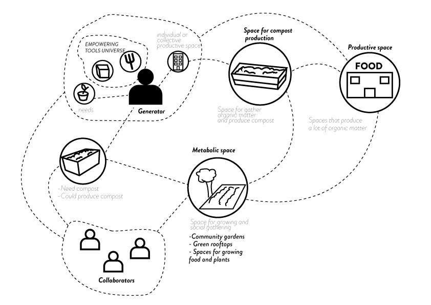

---
hide:
    - toc
---

# Alternative presents to emer-triggering tomorrow’s tomorrow.

## Alternative compost present (02/05)
We understand from our compost so far, many branches for development and many approaches from a regenerative practice could be designed and performed.

We decided to design around two main concepts:
1.- Design tooling for enabling the task for making compost; meaning that for this task is necessary to create tools that encourage any user to perform this activity and transform their immediate space with what they have at hand, including their our “waste”.

2.- Design for a community compost: once having developed a universe of tools and practices we pretend to create a network in which it each member could have a degree of participation and can contribute with different activities in different spaces.

### The present
The future present is to co design within the members of an active space, a system to have a productive compost around their needs, activities and design the artifacts needed for this to happen., empowering each individual and working with the and working with the nearest community.

####Draft of network, work in progress, not final

