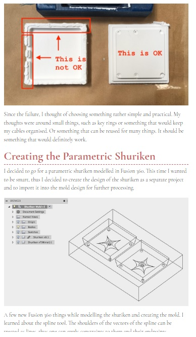
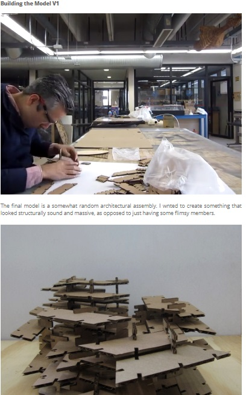
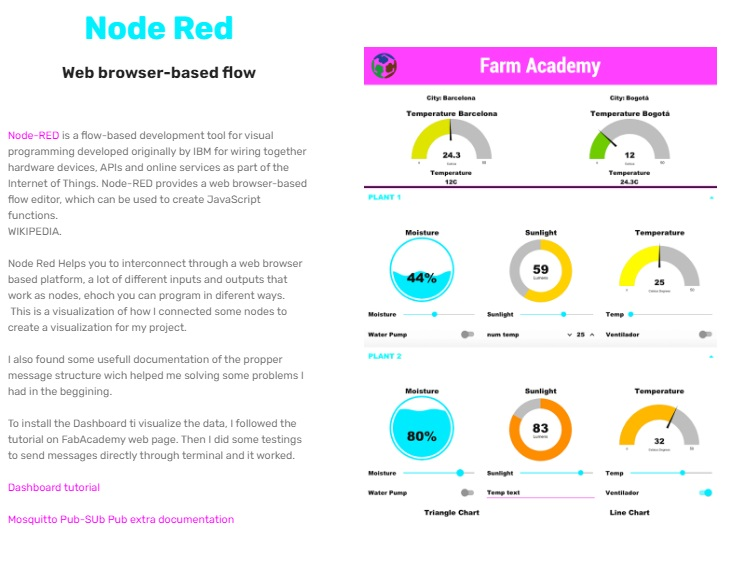
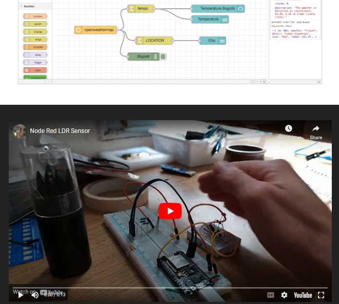

---
hide:
    - toc
---

# Week 1 FabAcademy

##Principles and practices, project management

### Examples of documentation

<https://fabacademy.org/2018/labs/barcelona/students/krisjanis-rijnieks/assignments/week10/>

I found these documentation interesting because of it clearness, he manages to document in a liner way, with text and pictures from each pass, marking and noting each detail.
I found interesting because it is an easy format to follow, more organic without having to complete a documentation sheet. I think that personally I could use a format like that in a word processor like Google docs and star documenting with every device I have at hand, cell phone, tablet or lap top, and ant the end paste the document in the webpage.

<https://fabacademy.org/2020/labs/ciudadmexico/students/rodrigo-shiordia/week%203.html>

I found that site of a student of the 2020 and he also use a blog type entry but que document must of the proces with Gifs from a video sample, so that is a good fast way to understand the materiality of the task and with a gift it is not needed to have a video payer embedded in the code.

<https://fabacademy.org/2020/labs/barcelona/students/pabzul/Fab14.html>

I found interesting about these site the use of two columns of information because it limits in a way the use of content and you can have next to it an image that support the information.
Also his site supports embedded videos from YouTube in which he recorded some finals steps of the process, to understand better the outputs  

