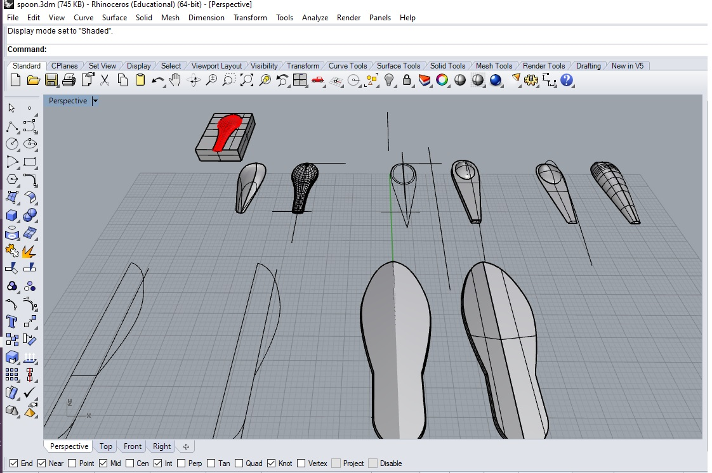
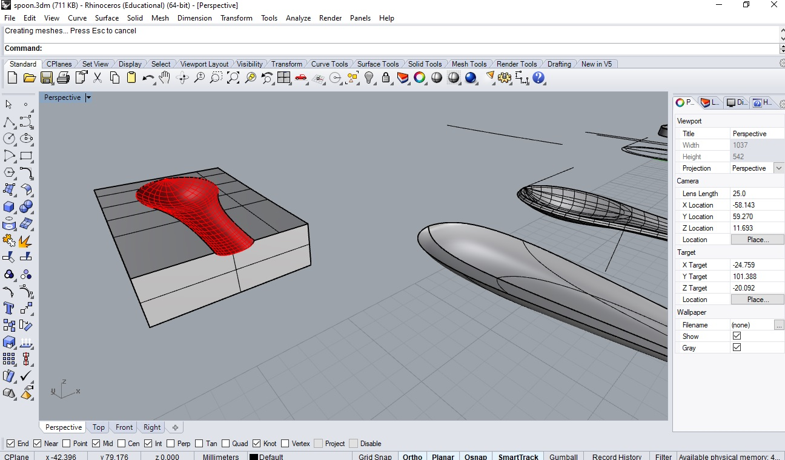
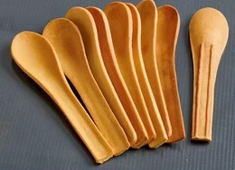
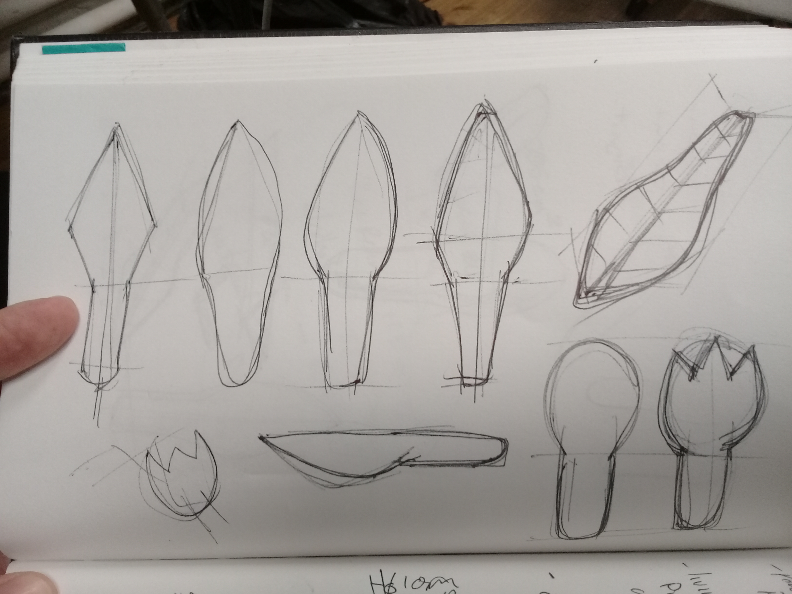

---
hide:
    - toc
---

# Week 2 FabAcademy

##CAD

### Example of a 3D model

This is a design of a spoon and a shovel using Rhino 5. The intention is to have a 3D model for manufacturing a mold.

This design is for a tool that could be used as a spoon or a shovel manufactured from coffee waste, as part of the experimentation of the Remix Materials seminar

###Inspiration

