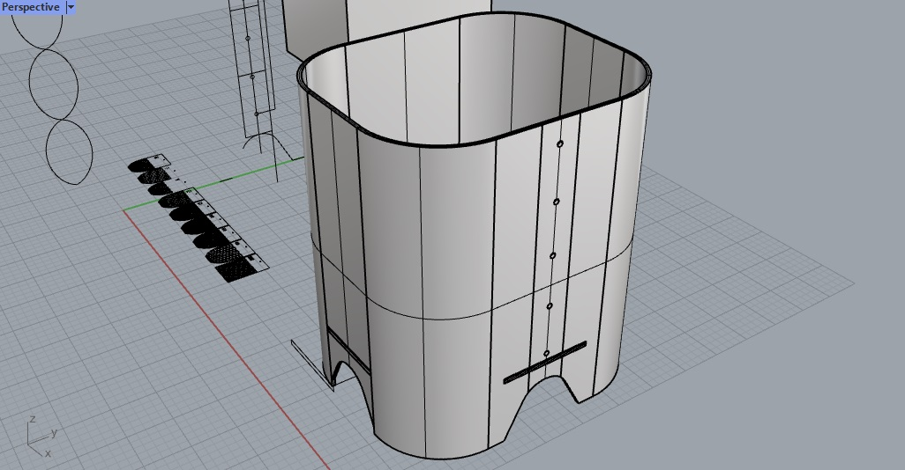
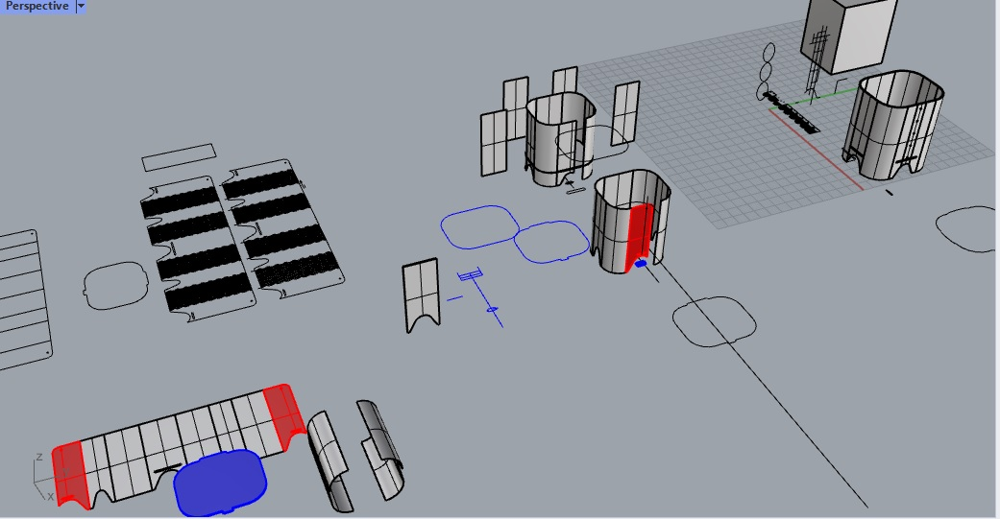
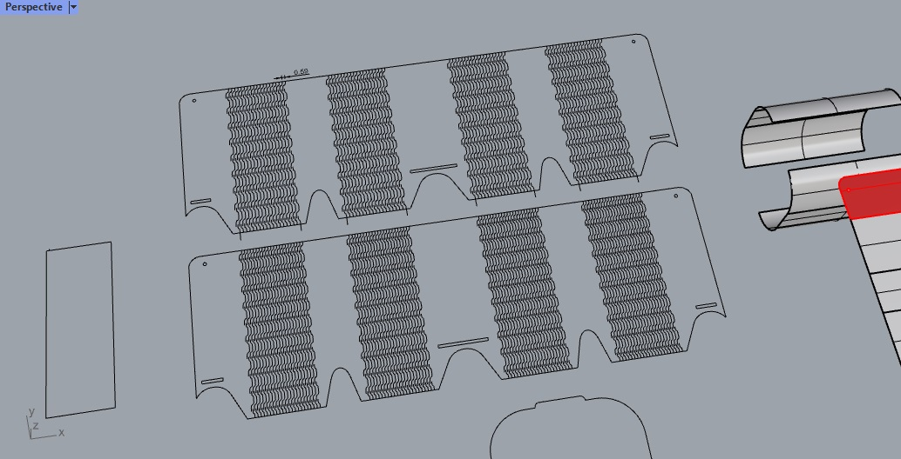
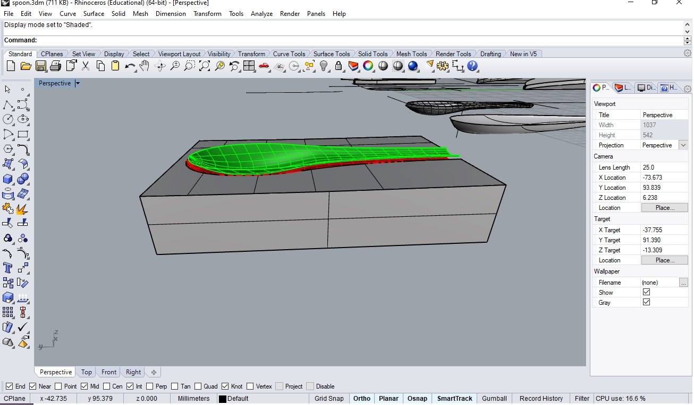
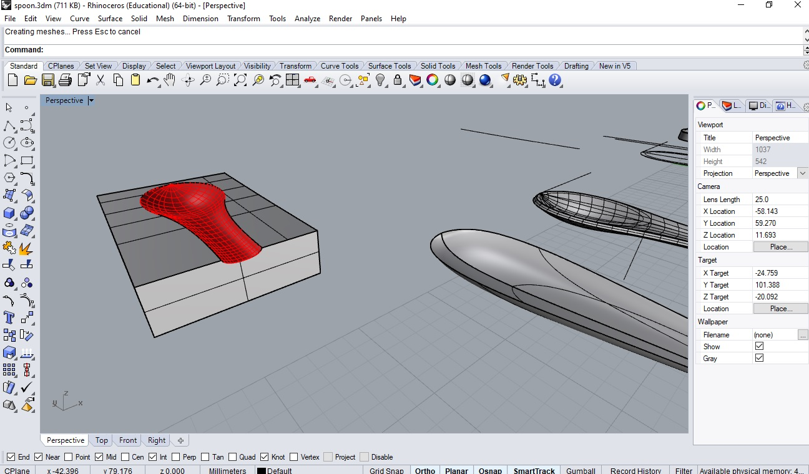
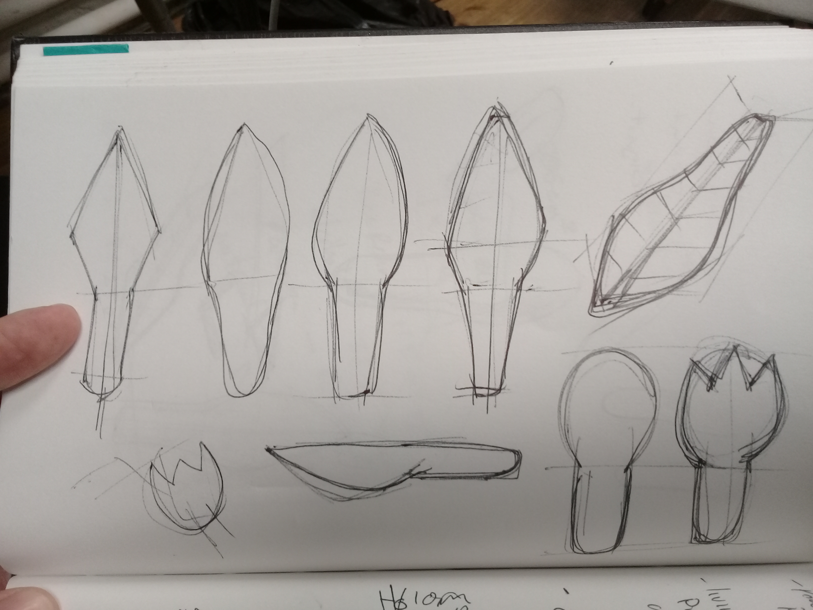

---
hide:
    - toc
---

# Week 3 FabAcademy

##LASER CUT

### Example of a 3D model

--Week 2
This week was oriented to understand about the different process of subtractive process, basically laser cut.
We understand the principles of the laser cut and how it is based by vectorial drawings, a format quite versatile in 2 and 3D software. Our intent was to understand the full potential of these machines and the basic information for operate them.

In this week we discover these machines:
-	Lasser cut, with the potential and contraindications, like the tolerances depending the material, the settings regarding these, maximum thickness allowed; which indicates you the limits in the design.

-	Vinyl cutter, we have 2 of them in the FabLAb classroom in which we can cut from paper and vinyl and thin material like that. A nice example with these process and material like vinyl, is to use it for screen-printing.  We can cut the vinyl in a mirror and paste it directly to the frame and use it.

My project for these week was to cut a trach can bin for my house as a part of a waste management system in-house. For this first exploration I used cardboard for it practicality. In these exercise I use Kerfing* for allowing the material to bend and design a lock system that allow the piece to close itself with the least extra material possible.

###process
I started to design It in Rhinoceros, with the next steps:
- First design the final volume desired and then plan the intersections.
After that, in the intersections plan from the material thickness how it was going to lock. disclaimer, in the first try out for the bottom lock I didn’t consider the thickness of the overlapping material.

- The next step was to make the volume in 2D using the tool of “aplastar”---I will search the command in English)

- Lastly with the model in 2D I create the drawings and ad the kerfing pattern, after that the drawing was ready to laser cut.

###Final product

