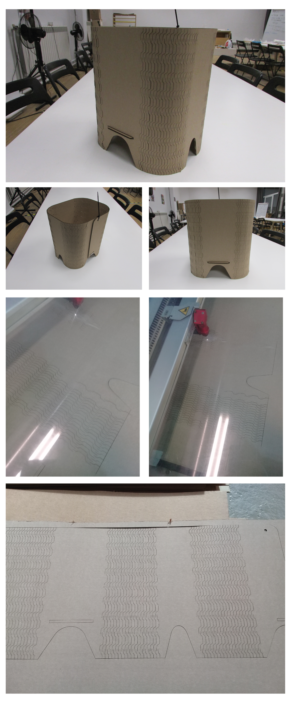

---
hide:
    - toc
---

# Week 4 FabAcademy

## Electronic production
PCB milling
This Week we have the opportunity to learn and practice more about the fabrications of electronic boards for the circuits design need for technological integration of our projects.
The first practice was about the process needed for manufacturing a circuit board, from the design and the software used to the different process, like milling, vinyl cutting, etc.
In this case we explore the PCB milling machines which is basically a CNC machine, smaller and accurate in which it is inserted a board with a layer of cooper in which the machines remove the excess of cooper regarding the layout of the circuit (subtractive process).

## Soldering
The next skill reviewed was the assembly the PCB by soldering.
In these part we review the different element for creating the circuits, from LEDs to capacitors; their orientations and values.
We performed an exercise of soldering different tiny components in a PCB, we have to watch the place, orientation and values.
We learn how to solder, the techniques for cleaning or removing the component of the excess of it.

