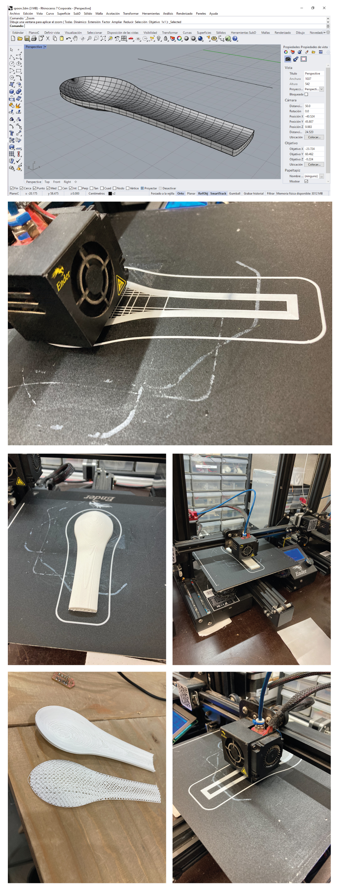

---
hide:
    - toc
---

# Week 5 FabAcademy

## 3D printing

In this part of FabAcademy we have the chance of working with the 3D printers and the scanning.

For the 3D printing exercise, I tried to use a 3D model generated in Rhino for the past week. We have the chance of reviewing different characteristics of these additive process, the materials like PLA, the machines we can use.
We review how to prepare the model and the conditions required in order to get an optimal print (temperature, speed, calibration).

Through the week I can observe different challenges in the 3D printing process like the calibration of the machines, the material feed, etc.

My object was intended for be used as a model for obtained a silicon mold for making samples with biomaterial. The resolutions were optimal for a quick time in the printing, because the bigger the object and the bigger the longer time takes to the machine to print.

It can also be printed the mold directly to be worked for biomaterials, but this will be explored in the next weeks. 

## Scanning.
For these activity we have the opportunity of scanning a regular object in order to have a digital version of it without modeling from zero.
The scan used was from an Xbox scan with a software interface that allow us to scan from a small object to an entire room.
In this activity we scan a mask and a person sitting in a chair for our different projects.
The interface allows us to configure the scanner, from small object nearby to a big room, and it allow us to export the file for a 3D software, with color or not and ready to edit.

