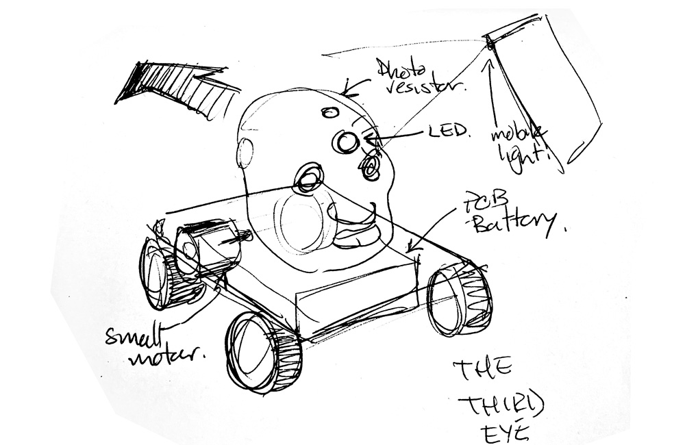
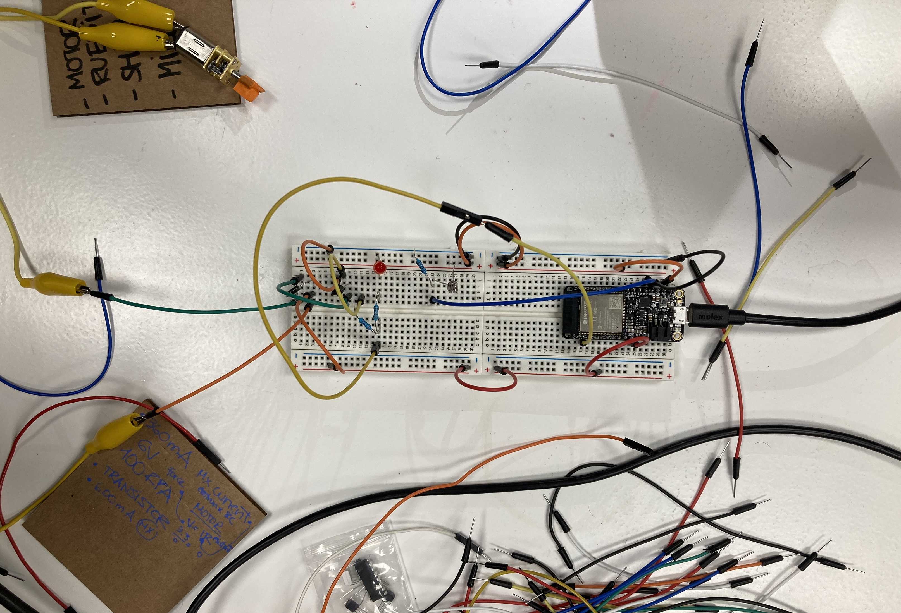
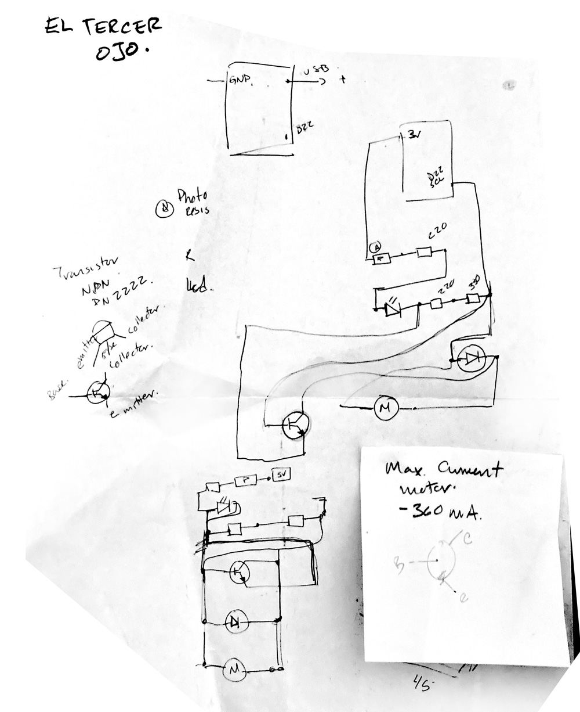
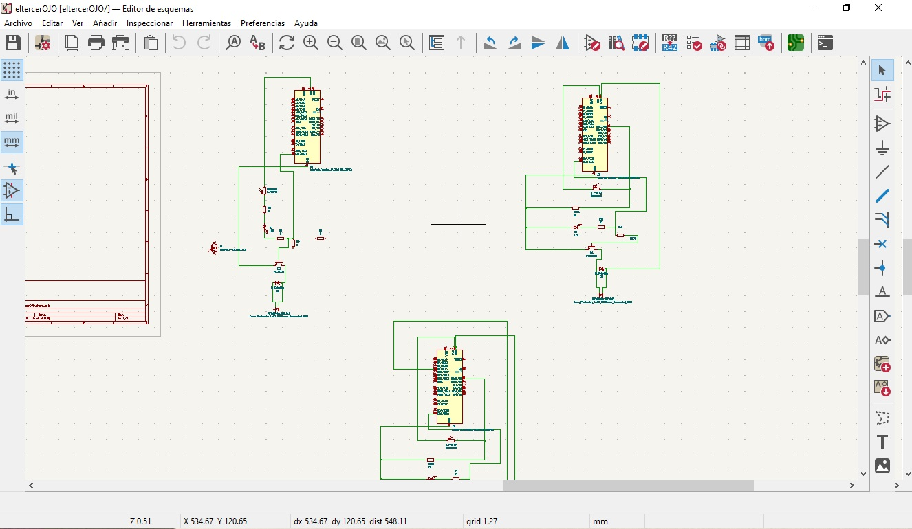
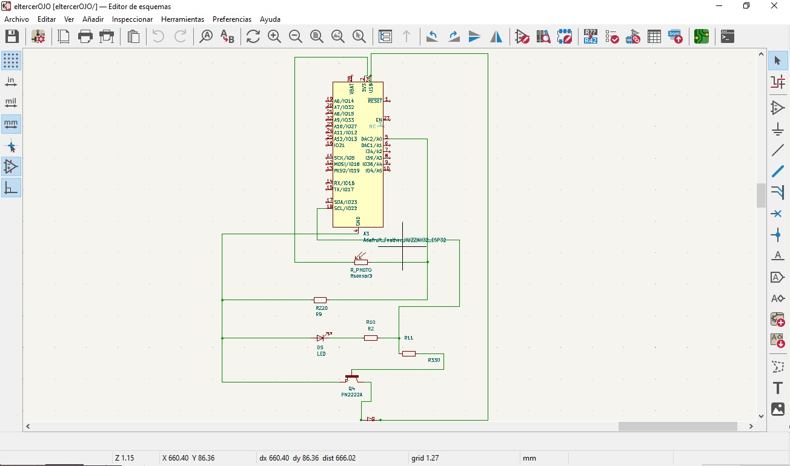
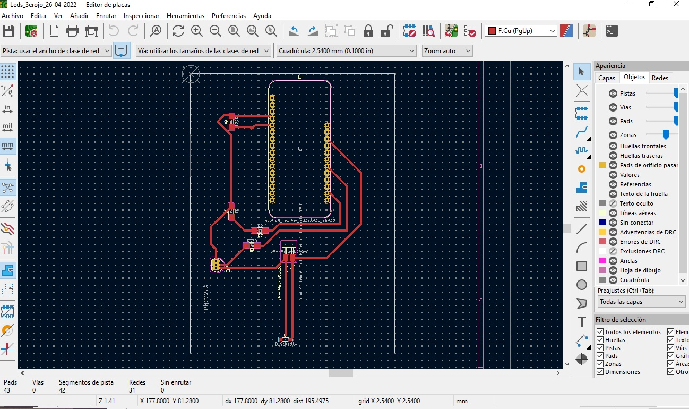
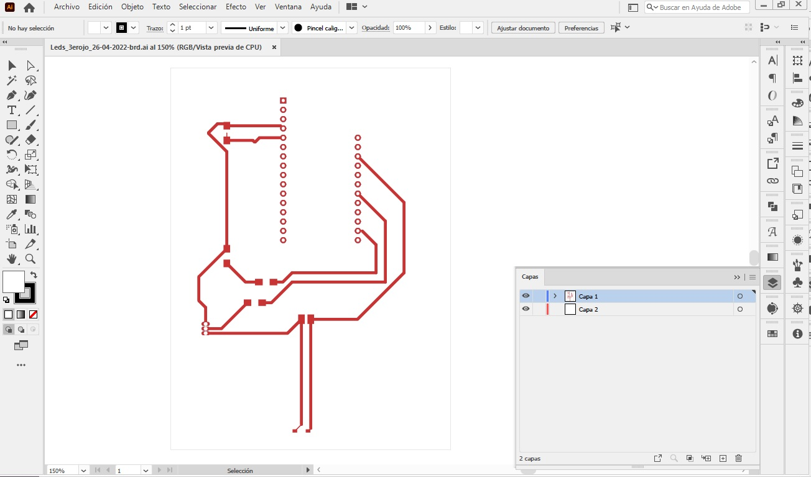

---
hide:
    - toc
---

# Week 6 FabAcademy

## Electronics design

From this assignment I use of KiCad as a tool for design and developing the circuits for the design of an artifact.

Our first intention was to develop a circuit using a photoresistor. The initial idea was to have playful artifact with the concept of the illumination of the Third Eye, and build it with the next assignments.

The function of this circuit was about using a photoresistor as a way to tur on a small motor in order to move the artifact. When the user throws some light to the photoresistor, it will saturate and when it passes the threshold it will turn on a light and turn on an engine.

With the help of Jeremy Paradie, we manage to configure the threshold of the photoresistor and have the correct Voltage for the motor.

After this sketch I use KiCad to have a proper distribution of the components and eventually have the footprint for milling the PCB. This project was ideated with Fiorella Jaramillo.

