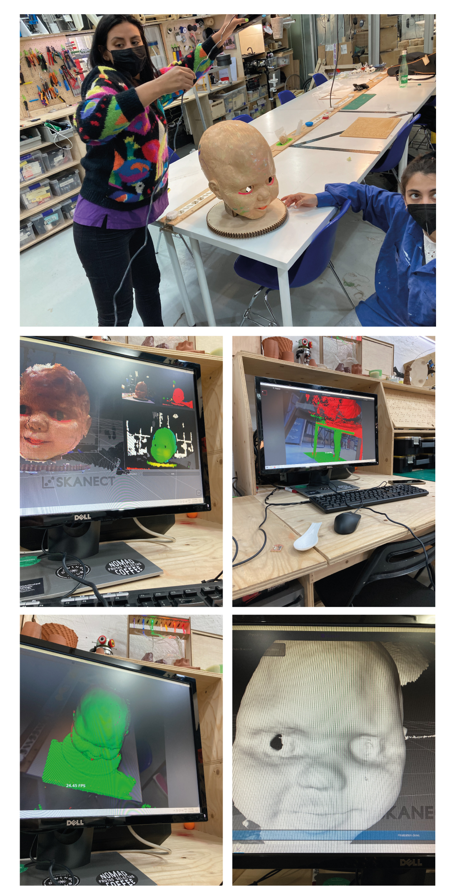

---
hide:
    - toc
---

# Week 7 FabAcademy

## Computer-Controlled Machining
For this assigment we decided to use it for the Challenge, with was the idea around our research concept of the master.
The general concept is to empower connections inside people of a neighborhood for make it more productive through compost. We try to engage with different organic waste producers in order to collect their waste and take it to a community garden for making compost there.
From this point we find a necessity to have an easy way to collect the organic matter from different places as a route through the neighborhood. So with this in mind Rei Matsuoka and I define a to design a trolley or collection cart for this task.
Sketch
From a sketch I design the 3D model in Rhinoceros to have the measures and proportions correctly for a person. A thinking of using a CNC process I design the trolley in a way for not using any kind of screws or glue. At the end it was needed to add a set of wheels.
Rhino print
From this design I get the blueprints for have the file to RhinoCam plugin in order to get the NC file for cut it in the Raptor Milling Machine.
For preparing the file for milling we have to follow the steps to configure it correctly.
First we have to select the orientation of the material and the type.
The tool has to be defined, the usual for Plywood is a 6mm flat tool
After the tool is defined, we have to group the lines if it is a pocket and its depth, out cut and in cut. For each type a configuration has to be set with the speed, depth, in cut, out cut.
After all of it is done, the places for the screws have to be defined by the option of engrave. This is needed for not allowing the board to move with the machine.

