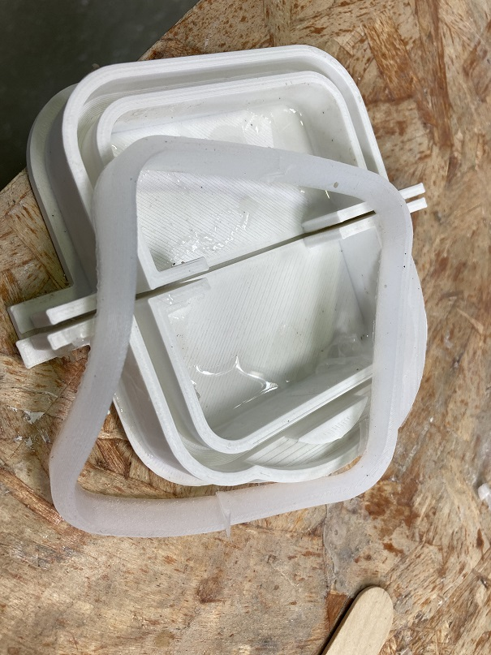

---
hide:
    - toc
---

# Week 9 FabAcademy

##  Molding and casting

In this week we saw a guide for the different ways of making a mold, from the type of technology like the scanning and 3D printing for reproducing something and the materials available for that and the process that it has to be done from having an original piece, the negative mold and then having a final piece, depending if it is going to be reproduced and how many times.

From this week, I took the sensor case designed for the [MicroChallenge III](https://emiliosmith.github.io/mdef_emilio2/FabAcademy/Micro%20Challenge%20III/) because it was a design that is supposed to be used outdoors, so I design a protector case.

In this task I try different forms regarding the material properties and which could be more suitable for the purpose I wanted.
I made a mold from the 3D model of the case that I have in rhino and 3D print in to have a mold.

After this I used the silicon platino (Easy Plat 00-30) which was too soft for the function that I was seeking.

From this test I design another form for the protector case, having in mind the properties of the material; but the result as well was not that satisfactory.

