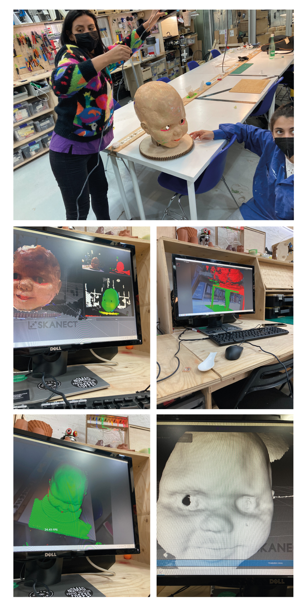

---
hide:
    - toc
---

# Week 10-13 FabAcademy

##  Inputs and Outputs

In these week we saw a review of the different components available or commonly used and their characteristics in order to know what we can use, their potential and how we can add value to our project.

In the case of the project of Compost Commune, we use the [MicroChallenge III](https://emiliosmith.github.io/mdef_emilio2/FabAcademy/Micro%20Challenge%20III/) to design a sensor for humidity because in the research of the project we found that maintain certain temperature and humidity in the compost is essential for its production.

With that in mind we start to explore the different sensors available for the soil and their applications with Arduino in order to find something that could be efficient and friendly for any user.

As first step we choose different sensor and test them with different types of soil and we try to understand the values that appear in the serial monitor and understand it logic. We try different sensors and we find that is common to have low quality sensors with bad readings; as well that it is common to used incorrectly by not choosing the right voltage pin or declaring an analog or digital pin depending the type of sensor.
After defining the correct use of the sensor we program the ESP to take the reading and transform it a percentage of humidity.

The first challenge was to understand the lecture, because this kind of sensor measure the amount of current that travel between its nods; that means when the sensor has the most currents is when it is fully wet, when it has the lowest reading is when the soil is totally dry and the current doesn’t travel easily.  

From this we have transform in the code the value of the sensor to a percentage of humidity in order to have some valuable input for the user.

The final concept was to have the reading of the sensor available on a IP address in order to be accessible to every member of the community garden. This point I will explain it in the [Week 14](https://emiliosmith.github.io/mdef_emilio2/FabAcademy/14%20week%2014%20FabAcademy/).

Pictures of the prototype

Because we wanted that the device was autonomous and no to rely on a computer in order to be functional, Edu recommend us to use a Lipo battery.
We choose a LiPo battery of 1000mAh of 3.7V, which was the voltage needed for maintain the sensor operational. The 1000 mAh so far, it has last for about 3 hours of having a constant lecture. And it is rechargeable with the laptop trough the connection of the ESP.
Pictures of the LiPo
From this device I design the KiCad diagram in order to have a PCB and mount the ESP, have the connection with the sensor and the LiPo battery and to have it in an accessible case.

KiCad Draw.
After the Footprint ready, I design some branding as part of the project Compost Commune and to generate the PNG files needed for milling the PCB. The files needed to be prepared by outline, traces and holes all in PNG black and white with the same size and resolution (1000ppi).
Ai and PNG files
When the files are ready in PNG, as part of the Week 4, they were used for milling the PCB in the SRM Roland. For using this milling machine I have to use the modsproject.org page for access to the programs and generate the. rml files required.
For this modules, we have to choose the correct SRM module and select between the 1/64 or 1/32 tool depending if it is a trace or a hole or outline. The speed, and the origin has to be defined as well.
Imagees of modsproject
After the .rml files are ready, they are charged in the interface of the milling machine. The first step is to choose the correct tool for the traces or the outline, then define and select the XY origin depending where the PCB is situated, and then the Z, which is more complex.
Note, for the outline we have to be very careful of not doing it to close to the traces or to the exterior or the PCB, as well we have to take care of the size and the color depending in which image processor you use.
After everything is situated we can start to mill.
The tutorial page is this one: https://fabacademy.org/2019/docs/FabAcademy-Tutorials/week04_electronic_production/srm20_windows.html
Imagines del milling
Muchas
After the PCB is ready we solder the components, in this case we only use male and female connector for the ESP and the sensor. The LiPo battery is connected directly to the ESP via port.
Imagenes finales del pcb
When the components are soldered, I design a case in Rhino, with the final size of the components, and taking into account that in could be accessible for charging and replacing the sensor. The case was 3D printed in white PLA and the lid was laser cut in acrylic.
Final pictures.

http://modsproject.org/

