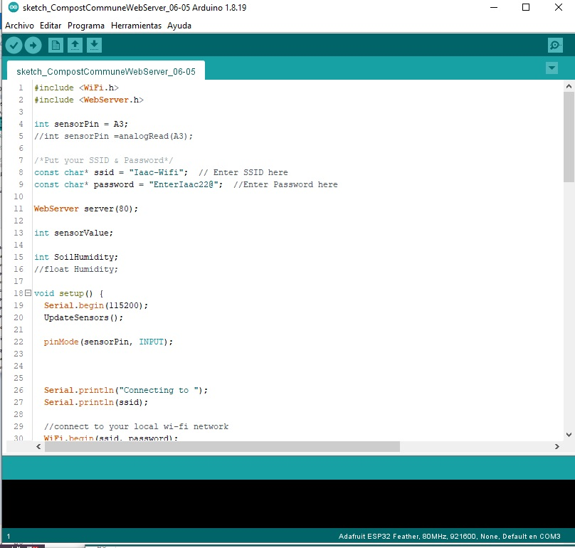
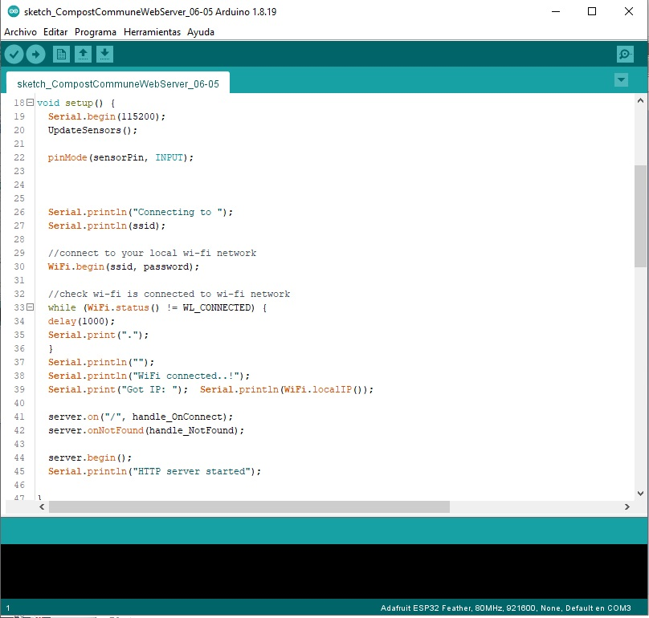
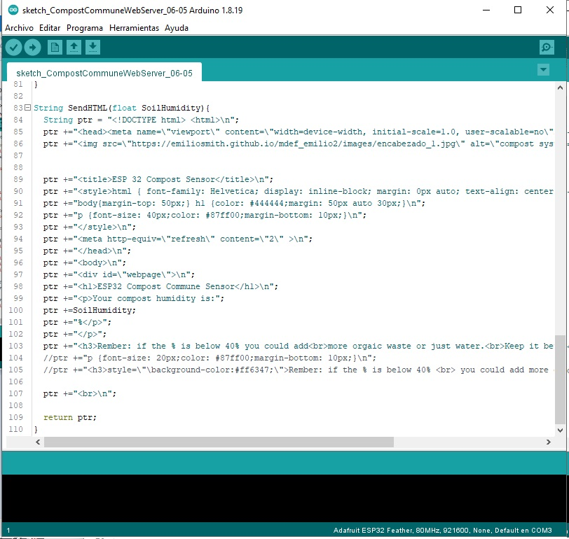

---
hide:
    - toc
---

# Week 14 FabAcademy
## Networking and communications

This assignment was part of our [MicroChallenge III](https://emiliosmith.github.io/mdef_emilio2/FabAcademy/Micro%20Challenge%20III/), which we sought to made a friendly and accessible sensor for the community compost project.

We try to have an ethical approach in order to have a democratic and empowering device through the easy access to information, and from that trigger some action between the member of the community.

The general concept was to have a lecture or reading of the humidity of the compost through a sensor. The humidity in this case is important because heat and humidity are required to be controlled often in order to have a correct production of the compost.
From the ethical perspective we sough that people get more involved in this process by knowing the status of the compost regardless the place they were, and by having this access to the information they could organize themselves and take action if it is needed. Therefore, people are more participatory and the task of taking care of the compost not rely in only one person.

For accomplish this concept Santi share with me some examples of how an ESP could be connected to the internet via Wi-Fi and create a WebServer. We found a project similar to the general concept that we have in which the ESP control a series of sensor and it transmit to a IP address the reading of each sensor.
[Link ](https://lastminuteengineers.com/multiple-ds18b20-esp8266-nodemcu-tutorial/)

This project was used as a starting point as well as the sensor reading do it in the Week 8. With Víctor and Mikel, we defined the logic of the code for the ESP.
First the Pin for the sensor has to be defined very careful because some ESP Pin’s doesn’t work with analog sensors when the Wi-Fi module are on, or doesn’t work at all.
After defining this, in the code is defined the lecture of the sensor and converted to percentage.  When this is ready the ESP create a Web Server by a connection to the Wi-Fi , so we have to specify the SSID and the Password and then the ESP creates an IP to handle clients.

When this is ready then it is pulled a HMTL code as a string (ptr). Is in this code when the lecture of the sensor is placed and because it is a HTML code we can configure the interface, which I will explain more in the [Week 15](https://emiliosmith.github.io/mdef_emilio2/FabAcademy/15%20week%2015%20FabAcademy/).

[Download the code from my repository](https://github.com/emiliosmith/Compost-Sensor-code.git).
