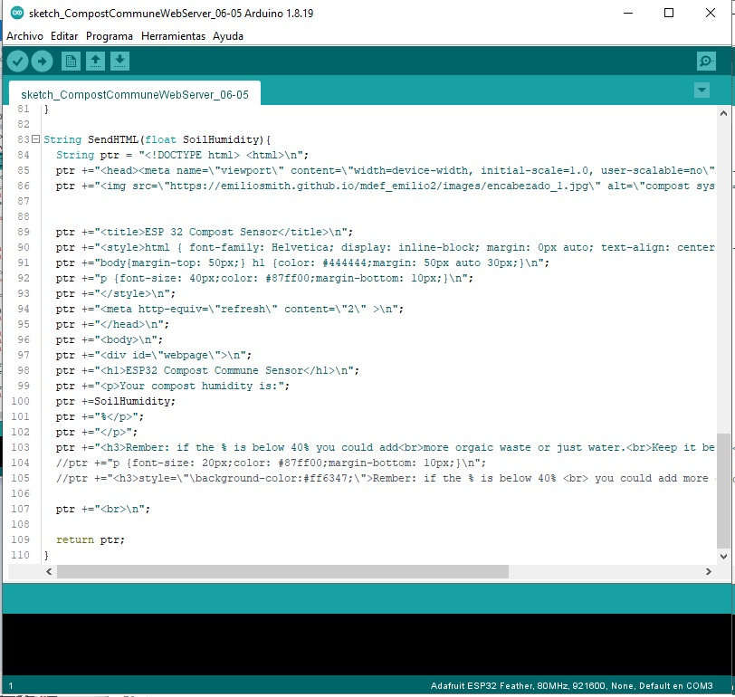

---
hide:
    - toc
---

# Week 15 FabAcademy

## Interface and application programming

In the weekly assignment as I explained in the Week 14; we use the Micro Challenge III to have a sensor reading in an IP by the connection of the ESP via Wi-Fi.
The ESP creates a Web Server, allowing us to have a HTML interface to display the values of the sensor which was expressed in percentage.

We use this HMTL to place a friendly branding that we have been using in different application during the project from the case, manual, color, etc.

We try to use this interface to have more information about what it is displayed. We use this HMTL to have the lecture of the sensor in a percentage but for a common user without much training in compost making a number doesn’t say much, so we add extra information and instructions of what to do if the humidity reach some value or other value, in order to empower and motivate the user to handle the compost and be involved with it.

### P5 Interface

After this task we explore different friendly interfaces with the P5 but it was very complicated to have it display the P5 via a ESP Web Server in the HTML.

The lecture from the sensor was capture by the code of the P5 by enabling the that we have was trough the P5 serial port controller.
[Tutorial](https://hackmd.io/9ha1FspPTlihjdzS5vsYYg?view)

Interface with P5 with te sensor

The interface on html
The sensor in p5
