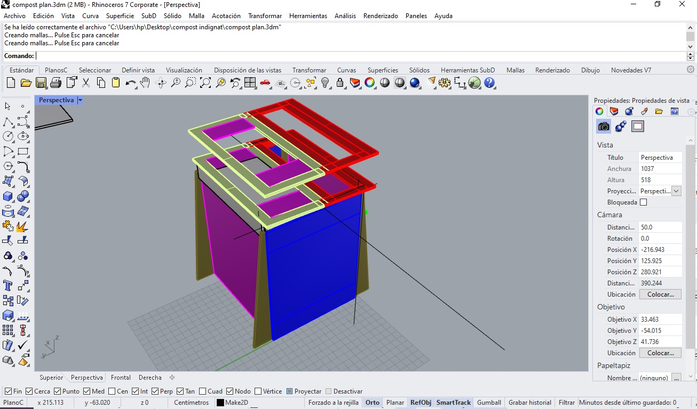
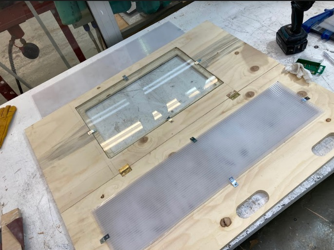

---
hide:
    - toc
---

# Week 16 FabAcademy
WW16 - Wildcard Week
For this week I intent to make a lid for the compost bin with composite in order to create a greenhouse effect in order to increase the efficiency of the compost making.

