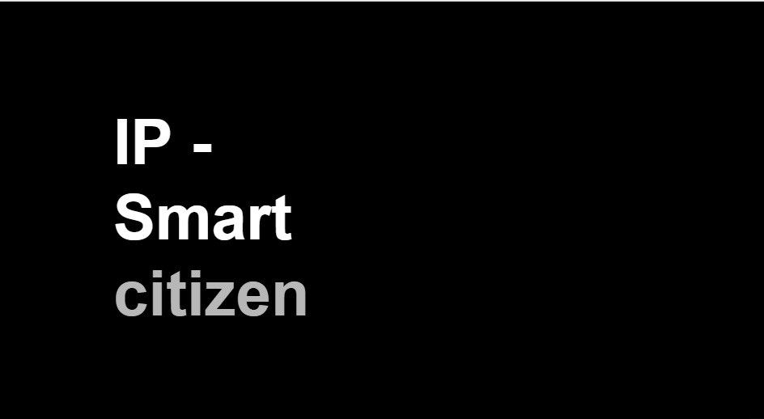

---
hide:
    - toc
---

# Week 18 FabAcademy

Created a dissemination plan for your final project.
- At this time of the project, it is hard to define a dissemination plan, because the compost bin or composter is a response to the needs of a community, which is based in concept of circular economy for food waste management, regenerative design, and proximity. The engagement of the community is based on the characteristics of the neighborhood that function because the proximity to the garden and the space; it would be hard to define that as an standardized intervention, but at the end the design intervention could be documented in a online platform that eventually could function as a repository for opensource information and blueprints for more compost related projects.
Because it will function as a community the revenue scheme or income it is not contemplated.  

In said platform could be documented this interventions as an inspiration for others social projects but at the end, an online platform is not going to make a community intervention and a community intervention is not a platform.

From the community perspective it is expected that people of the community garden transform themselves into compost experts and find the motivation to transform their garden in a green and productive space, to be a urban farmers; with that in mind, making compost from organic waste is a central activity so as close community they can ask and recall from different establishments the organic waste for their compost and create value chains in their own terms. Than networking already happen, some of the members of the community garden ask for the organic waste to different places around the garden; it is needed to stablish connections and gains for all the members, and that happen when people walk in the street and talk to each other.

Outlined future possibilities and described how to make them probabilities
From the online platform perspective it could be relatively easy to start, it can be used Github as a starting point for repositories for the different information generated, like opensource designs and techniques as well to allow people to share their own knowledge.

 From the community intervention, the composter will start discussions an generate new needs and gains, as any new service or product within a community. The compost bin, if it correctly used will produce quality soil for the garden, that eventually will lead to a regeneration of the soil and to have productive spaces. People will notice a before and after the use of the compost and they will search for a way to increase its productivity by creating a network of neighbors and using entirely their organic waste.

Choose a license (open/closed) of your choice for your final MDEF intervention.
Many information about compost and soil analysis are available on line, it is need perhaps a way that shows how to apply it. From a platform perspective has to be a open platform.

In a community based project the approach of the design has to be horizontal, collaborative and has to born from the necessities of the communities, it has to be discussed and voted. An external factor could encourage the use of a new initiative like making compost but at the end the community will decided if the activity is assimilated or not.  With that in mind the intervention has to be molded around many times in the community.

## Invention, intellectual property and income

During this class we have a discussion with Oscar and Victor about the different implications around a project such as Smart Citizen. We discuss about the perspective of creating value to the user using the infrastructure created with Smart Citizen in particular the use of Intellectual Property.

We made an exercise to imagine an alternative to generate income in a innovative way using different approaches, postures or resources.

At the end our proposal ought to use the way Smart Citizen gather data in favor to enterprises or companies in order to use to search spaces to avoid environmental regulations.

[Link to presentation](https://docs.google.com/presentation/d/1E0fIrCtDiWVPtm7sNuhL814C_X-xlmCWKe7pEooOfdY/edit?usp=sharing)

