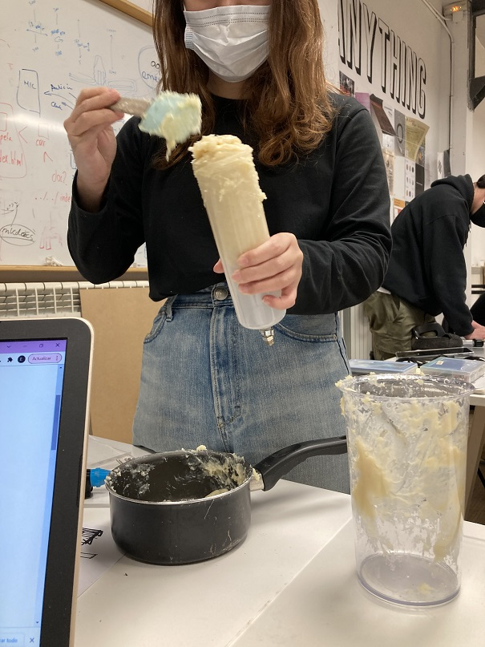
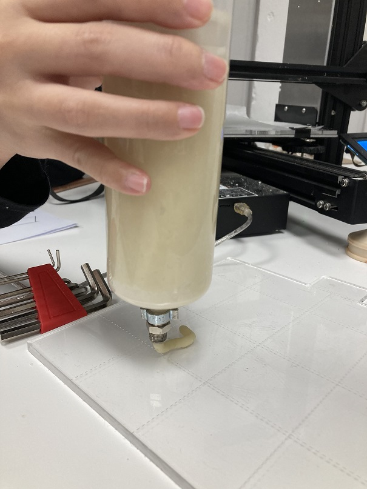
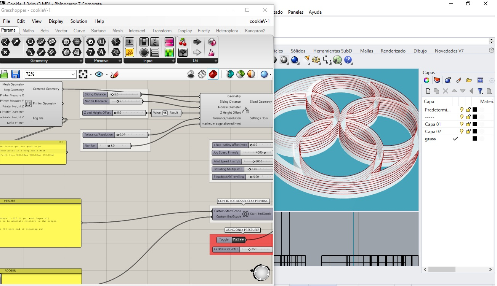
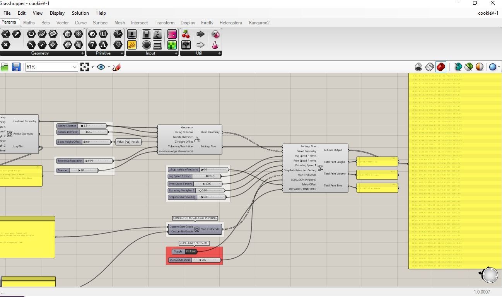
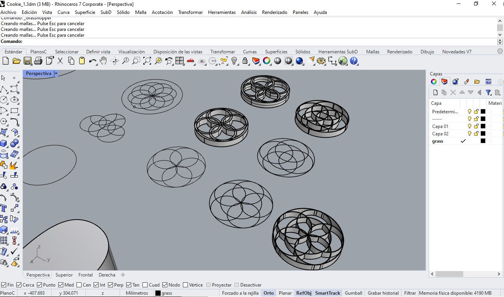
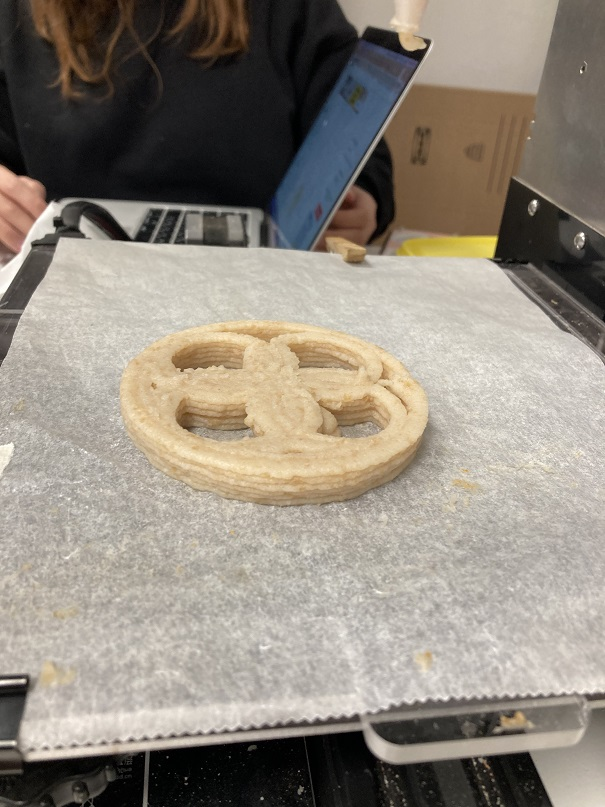
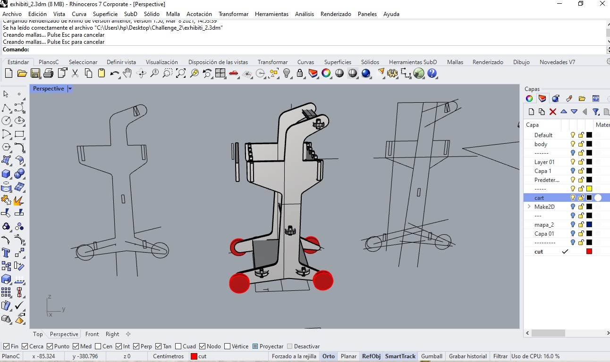
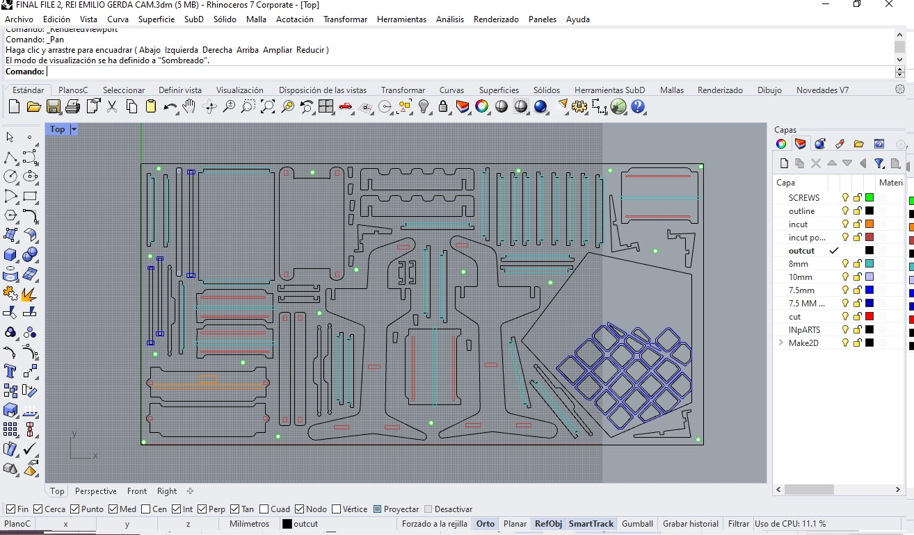
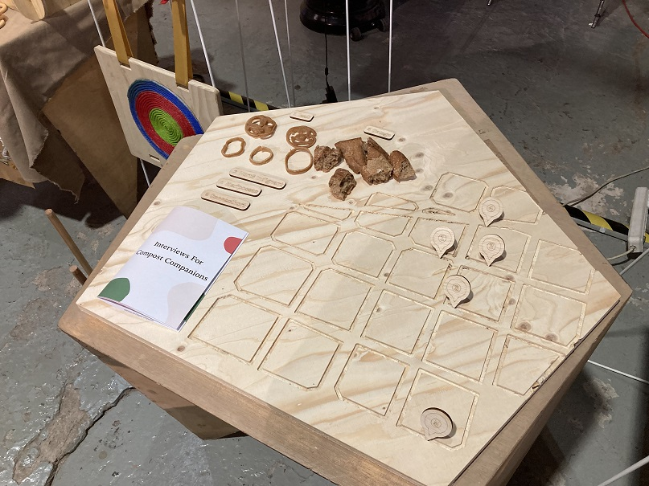

---
hide:
    - toc
---
# Micro Challenge  II FabAcademy

### Personal reflection

## Exploration around food waste.
We use this challenge to explore different approaches to the concept of our research. In this challenge we decided to have 3 main goals:

- To offer a different to the user to the food waste (*3D printed bread cookies*).
- To have artifacts that could strengthen our concept of a network of collaboration around food waste for creating compost (*Compost cart*).
- To have some aid for our Design Dialogues exhibition (*Exhibition aid*).

### 3D printes bread cookies
During our research around different organic waste producers, we identify similar organic waste between them; coffee, bread, some rice and pasta are the most common.

With this in mind we wanted to offer to the user a different view of their organic waste, that at the end it is not waste, is organic matter that could be used, processed or transformed in different way, and still be useful. We can have organic waste for the compost or we can have new product from it. We can design and make tool from it or even print it for creating artifacts or just another type of snack.

From this concept we approach to a cantina near IAAC, the Taverna Galega, in which we asked Juan for his organic waste; we took the bread and we use it for 3D print it to explore and understand its potential.

First we have to define a recipe for the bread, because in order to use the machine, we have to have a "pasta" type of material. This "pasta" has to be with the right consistency to be extruded by the 3D printer.

So Rei tried different proportions of water and salt, and adding that to the mixer with the bread.
imagen

For us to know that if the past would work, was to try it in a syringe (ass suggested by Edu).

After this test and the recipe defined we start to making some test with the printer.

The pasta 3D printer works a little bit different to the PLA one´s. For operate it, we was to define the path that the extruder is going to follow to generate the shape; this process we have to do it in grasshopper to create the gcode.

>Note. If you use it, you have to consider the thickness of the pasta that you are using it and how it will deformed when it is deposited. when you have defined that, configure the height of the extruder between layers.

I use the grasshopper file that Edu share with us. Many thanks to Dafni and Edu.

In this time we explore different shapes, layers, thickness, as well another material, like regular pasta, which at the end it didn't work well as material.

When the samples were ready, we put them in the oven to "cooked" them for changing their consistency and maybe have something edible again.

We use this samples and explorations to our Design Dialogues exhibitions of how the organic waste around the neighborhood could be revalorized an use it for produce somethin else by upscaling it.

### Compost cart

From our research in the neighborhood we detected the need to have a tool that help us in the task of recollect the organic waste.

So from this we design a cart, using CNC machines to cut a plywood sheet ad build it.

I explain this project more in detail in the [Week 7](https://emiliosmith.github.io/mdef_emilio2/FabAcademy/07-week%207%20FabAcademy/)Computer-Controlled Machining .

### Exhibition aid

In this task we wanted to seize the material and the process that we used for the Compost cart and maximize the use of the CNC machine.

As part of our Design Dialogues exhibitions we wanted to show the different stakeholders around the neighborhood and to show the most common organic wasted produced by them. We made a board of plywood which shows a map of the neighborhood. We manufactured this in the CNC machines with the compost trolley as well as some support for the different bio-materials that we have been working with.

#### ---- The next post is the team documentation  ----

# Micro Challenge  II FabAcademy
link to repository
(https://github.com/terauchi-rei/fabchallange2.git)

*FabAcademy 1st Challenge Feb.15-18**
===============

by [Rei Terauchi](https://terauchi-rei.github.io/mdefweb/) & [Emilio Smith](https://emiliosmith.github.io/mdef_emilio2/)

2nd Fabacademy Challenge*
Initial Ideas and Purpose
This time we have decided to print local food waste in Poblenou to regenerate something edible. Since we have been focusing on food waste and compost for the past design interventions, we have wanted to have another approach to it. Actually we were planning to design a hydroponic chair for this time, but when we came to think about the relation and continuation from our design intervention, we thought that we should keep focusing on the food waste topic. Probably we will work on the hydroponic chair another time. (Also we need to figure out arduino stuff to do it)

##Link to our project For the past few weeks, we have been trying to get engaged in the Poblenou local community, especially those of community gardens and local restaurants in order to make a small circulation in the area. We have been asking if we can get their food waste to make compost in local community gardens to local restaurants, and we have been asking if we can collaborate in making compost for local community gardens.

. .

Recently we have been in touch with this restaurant just across the street of IaaC called Galega, and the owner is so friendly. He gives us a lot of coffee waste and sometimes bread from the day before. Bread can be printed into something like a cookie we found in the article. We decided to 3D print it and exhibit it at the design dialogue as our different perspective/approach to the food waste and compost topic.

Also to exhibit, we have decided to make a stand and a base for the exhibition to put the cookies on and also for the other stuff we have designed already. Additionally we also designed a push cart for carrying waste and soil from one place to another. Because when Galega gives us a big bag of coffee waste, it is super heavy and hard to carry.

We both worked together, but Rei mainly focused on 3D printing cooking, Emilio mainly designed modeling for CNC.

.

Fabrication Process
<3D PRINTING COOKIE>
This time we used bread from Galega. We actually tried the test with pasta which Emilio found in his kitchen, probably from a long time ago.

We first boiled the pasta with a bit of salt and smashed it with a blender into a dense paste. We tested with a cylinder if this paste is thick enough to extrude. Once the paste looked fine and tasted fine, we put it into the cylinder for the 3D printer. We tried the test printing with a small circle.

.3w7AgmXdM15vgqxXv5PC1648207302-1648207390.gif
 .

It was okay for the first time but as the paste got more dense as it dried out, it became much harder to extrude because it stuck in the extruder.

. .

Learning from this, we decided to make bread paste a little bit loose.

.

First we tried a circle and it went well for several layers.

.

After that we tried to make our own design of a cookie.

. .Videotogif.gif
 .Videotogif2.gif

Somehow there was something wrong with the code, the paste mixer of the 3D printer did not mix, we fixed it on grasshopper and it extruded constantly.

. . .

This is how cookies look and we tried some of them baked in the oven. Emilio tried it and said it is not bad.

. . .

<CNC EXHIBITION STAND & ETC>
We designed them from a sketch and into 3d modeling with Rhino, and cut them with CNC. It was our first time using CNC at IaaC.

. . . .

We designed several different things for the exhibition. One table, two stands, and one push cart. We made the data carefully by checking the tolerance and diameter of the pockets.

.

Problems
For 3D printing -The paste of the food waste easily gets thicker so it gets stuck with the extruder. We added more water to manage it. -The mixer of a 3D printer stopped mixing the paste. We changed the code in grasshopper to manage it. -When we tried to print the complex design, the extruder squished the printed paste because it went over the same paths. We thought we needed to model the design that each path goes on the top of another so the extruder will not go on to the other path. -Printed paste dried but cracked easily, there needs to be something flexible for the recipe to make paste.

.

-Maybe normal shapes can be just made with a mold.

For CNC -It is always hard to check the right tolerance before cutting. Also it should be faster to manage that by using grasshopper, we want to try that.

Even If only one cutting data is wrong, we need to cut it again. -It takes super long time for engraving and cutting.
Future Development
We thought 3D printing food waste is capable of giving us a new perspective in dealing with food waste and compost. Usually wasted food doesn't look attractive at all so no one eats it, but when it is printed with a 3D printer, it looks attractive so people would eat it. It can be an interesting fact that people will think of food waste as something edible and also for waste consiousness. We want to try to make more complex shapes and a variety of food waste paste to develop this project. To do that, we want to make something that actually makes food waste printed taste good and develop a recipe for open source. We will keep in touch with neighbors as we try to get the food waste from them also using our push cart.
