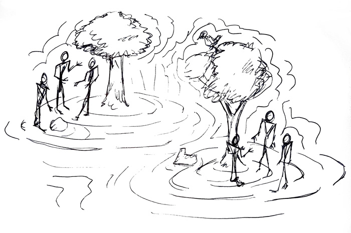

### Paper Making Sense and Meaning

#One with the context

### Beliefs and knowledge about what design means for me.

Design as I perceived it, under a system of mine believes, a result of my experience since college to my professional practice, with knowledge I have found or collected in these years.

I observed the design from my local context understanding that it exists an ontic reality, which is not necessarily what it is true but is there; this vision has been expanded and at the same time narrowed in my brief journey in the MDEF

This reflection practice, represent for myself and exercise to have an understanding of the plausible in design in my context, for finding a truth by contrasting my beliefs and knowledge of what, I now understand that, I didn’t was aware of. It is not my intention to have an ultimate truth or dictate any kind of practice.

 This exercise is more an intention to create an objective truth as possible could be, identifying the possible bias inherited in me by my context and my journey through my lifetime and hopefully this practice could work as a reference for anyone else.

How much of what we believe is actually true? What we believe is right? This questions have to be a constant in our head, it has to be present in any creative process therefore in design practice.

We love design by it potential for creating amazing artifacts and changes in our environment, but not every idea of every person has this goal.

We have been taught inside a system in which we believe that we are unique, and our voice and point of view is exceptional therefore dominant and valid, derivate this by years of colonialism and capitalism exploitation, and that actions has been explained and in different ways and contexts, by different authors like Paulo Freire and Franz Fanon; this action of domination and imposition is mentioned by the EZLN and there is in design a movement based on a manifesto dedicated to eradicate colonialism from design practice (http://www.decolonisingdesign.com/statements/2016/editorial/).

This background shapes from our personal live, through our professional life; we as designer believe that we have the ultimate decisions, that every detail, has to be dictated by us, under our supervision, and that has been a constant from many years and it is present in many fields, not just in design.

Of course it exists examples in which a personal decision has to be crucial, due to their hyper specialization in an area like medical, engineering, etc. It is understood that there are specialists with particular knowledge or expertise that has to be consulted, integrated or followed. We have to be humble in order identify the necessities of the design process as well, understanding that sometimes specialist have to work under different paradigms, but in sake of a creative process, diversity has been proved to be more effective if it is part of a broader system, as well and identify our role, the role of others and ours grade of specialty.

The design from my context, could be perceived and eventually understand as an action performed by humans through the movements of their body parts ignited by a cognitive or creative process with the end of transforming or interacting with their context.

From an academic perspective, design could be represented by a creative process that shapes the historical materialism in an industrialized culture; but as well design could be a performative activity that could allow any person in any culture to express themselves through interaction with others, human or not human, including his or her context.

The definition that I am used to, from college is the one from Fernando Martin Juéz that states that design is inherent in any human begin and a reflection of its “capabilities” or “talents”. We use this activity to transform our world, and design is more a socio-cultural activity rather than a consumist activity.

But as well design is used to define the action of designing an algorithm, a public policy or an automobile or a chirurgical tool.

Design in the contemporary, from my belief, is an activity that is empowered by a variety of processes from the far technological to the far artistic specter, understanding that they are not mutually exclusive; is in that specter where design as practice nurture itself to have a bigger, broader, and deeper impact.

Design is present in a process of shaping a stick with a rock for making a tool as well as designing a bridge in parametric software and 3D printing it with a machine.

## How can design help you to achieve your purpose?

From my time in the MDEF, I have understood that, we as a designer we have to be aware that we live in a hyper connected world, that any idea that we thing that is original or unique probably some already have done something alike in other part of the world, well documented and shareable.

Is in this context that having a broader perspective of what exist outside of our context, and be open to every resource available and approachable.
Open source technology, decentralized services could empower any people to star embodying the change by themselves and don’t have to relay in other people to star.

In the design practice we must relay in other people to grow as persons and to nourish any creative process to have a bigger impact and influence.

We have to understand at this point that true change has to happen outside the capitalism paradigm and for that we have to understand what words like growth, consumption, production” means in the context of our practice or what means with the people involved. Is with this in mind that design as business as usual has to disappear; design firms, design brands often keep empowering the same paradigm; from the big, white design office being a space alienates us from other realities, and the methodologies that reduce each complex individuals to consumers, users or stakeholders; with an environment to which we don’t want to harm.

## Biting The Hand That Feeds

From my beliefs, we have been thought that our name our vision has a value, and from art we tent to adore the big masters, big firms which mainly are men. With that in mind we try to print in our interventions our will to prevail through time, aspiring to be recognized in posterity.

I believed that this conscious or unconscious agenda is part of the problem so far, by problem I mean prevailing the same dominant system. We tent to make artifacts that last and that will speak for us through the years.

In a current scenario, how many things have been created? how many resources have been used? How many co-creation process have been poisoned by our ego?

Design has to be “egoless”, we don’t have to put our image our personal brand or our company brand in order no feel relevant in the history. That has to be the less important for shift to other paradigms.

The mindset of the permanence of the ego respond to the canons of authorship present in the private property for exploitation. In contrast, for many years, different craftsmanship from indigenous communities are often seen as a collective effort for communicate their cosmovision and satisfy their self-consumption accordingly with what they have in their environment. The images, meanings, drawings, materials and patterns are part of their identity and the environment, and define them as a collective.

Globalization, a symptom of capitalism is used for designers as a curtain to homologize our design all around the world, we used as a pretext conscious or unconsciously because we want to be part of a global esthetics, a part of global movement and to be recognized globally, as an example Fast Fashion.

In a design practice this led us to decontextualize our design using materials, process that eventually are going to create an artifact that doesn’t belong to its local ecosystem and with an aspirational aesthetic, to be globally accepted.

There are many examples of a positive practice that talks about using the hyperlocal resources to create anything from textiles to social innovations. In México there are exceptional projects in which through the craftsmanship from indigenous groups, artifacts are created under new paradigms. They required tremendous energy to keep using ancient techniques and create new social interactions around the project.

A project I enjoy is Fábrica Social (https://fabricasocial.mx/) which works with indigenous women from the south of México for creating garments that reflect their culture honoring their cosmovision, this project is a fusion between designers and people from an horizontal and participatory perspective.

Another approach that aided this framework is the Lo-TEK, concept coined by Julia Watson mostly for architectural design, in which the materiality is crafted from the local knowledge and linked deeply to their environment

I have read many times the use of the word “vernacular” for describing similar practices, which I find it as an example of the aesthetics of the colonialism. The meaning of vernacular is used to describe something that is native from a specific place, but is used to describe something that is placed outside of our context, in that way we differentiate our intervention in other people’s context in a colonialism approach. The language transform and we as designers can start by naming the thing are they are, we can start using word as they are named from the local and If we collaborate, co create or design for/with.

Projects that part from the local are around the world with good and bad practices as well, but are the less if we comparing with all the needs we have under the capitalism paradigm ways of living, and it doesn’t cover our all specter of necessities and must of them are created inside of the capitalism system in which the rules of the free market are still an ultimate decisive factors, like price and placement. Having that in mind there lays an opportunity to co-design, to co-create another system that allow us to change drastically for a better life, in which humans as are important as any other living organism, and that is design with the eco.

One alternative of this system is the Sitopia, a concept derivate from the utopia (Carolyn Steel), which put the food in the center allowing to shape our relationship between each other as a part of an ecosystem, another concept is “El buen vivir” used for different indigenous cultures around Latin America and a concept used by the EZLN in which is stated that humans and their ecosystem are conceived as a sole being, structured by the cosmovision of each community; this concept has been present from thousands of years in indigenous cultures but now is presented as a “radical” counterpart to capitalism.

As a professional practice, we as designer tend to think as part of a capitalism paradigm, in which  progress and growth mean “nicer stuff” that eventually we are going to design.

How we decided to approach this paradigm in a personal or collectively is a political action, a statement of design, which could be not in favor of over exploitation and over consumption; Design in many ways could be performed physically by what we have at hand; due to that, it makes sense to have the ability to modify what we already have or what it exists.

Strategies like the ones from circular design aided by spaces like the Fab Labs, are an efficient infrastructure for an alternative ways of improve the local context with which is available. Is common to have breakthroughs from collaboration, for adding diversity in the process and thinking as a part of a system, the diversity comes from working with other people, as well the diversity of tools and technologies that are available in their context.

## Design is a reflection of the personal context

The way that design is being used to shape the world, like many other activities, is a result of a personal vision, and being one with our context, the place that one has in the world and as a part of a community; is in the way that we use our soft skills, our social network and privileges is how we can have more or less influence in the transformation of our immediate reality.

Understanding where we come from, what identifies us as a part of a community, shape our practice as designers, and is our labor to identify what we have to do, what it has to be done, and with whom to do it or not to do it.

It is a personal responsibility to confront our reality and understand our context and its needs, it is not mandatory to be an eco-designer o social-designer (or other buzz words-designer), but so far the social and environmental problems are well documented and even over-diagnosed, so now it is our duty to know that as a part of a community and to act to shape a world for everyone.
