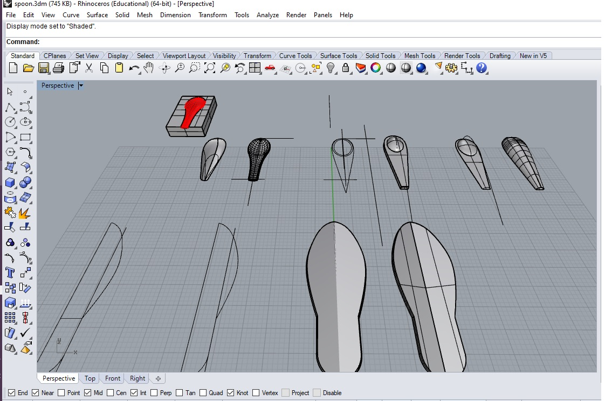
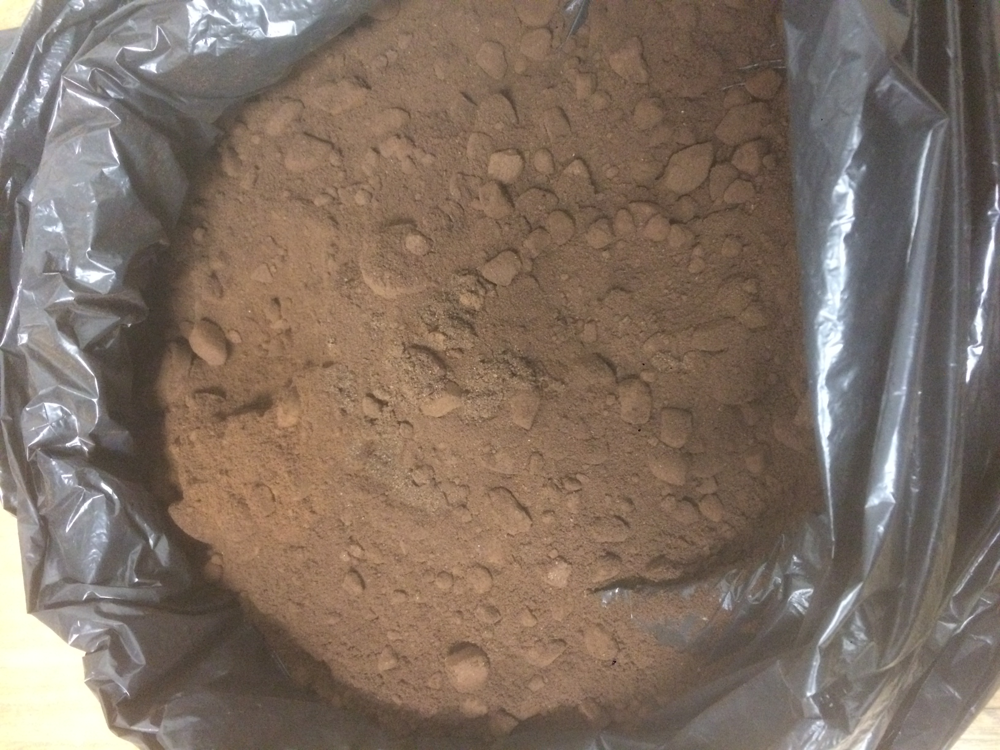
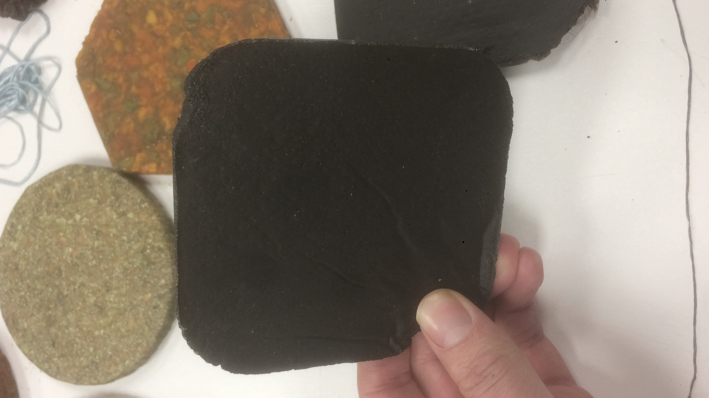
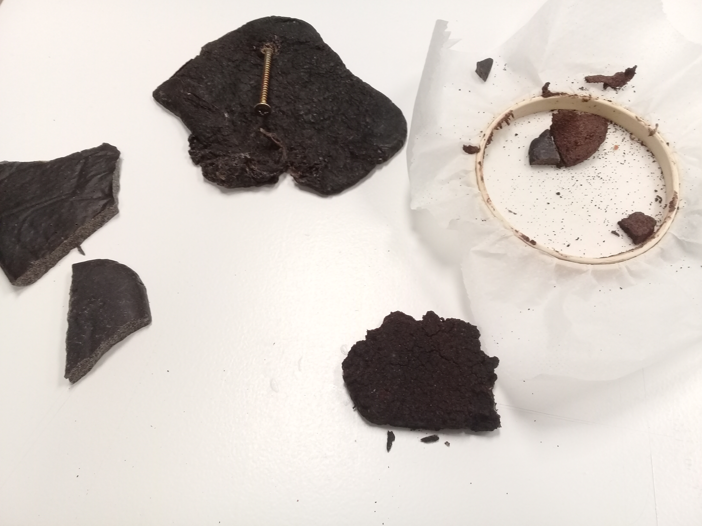
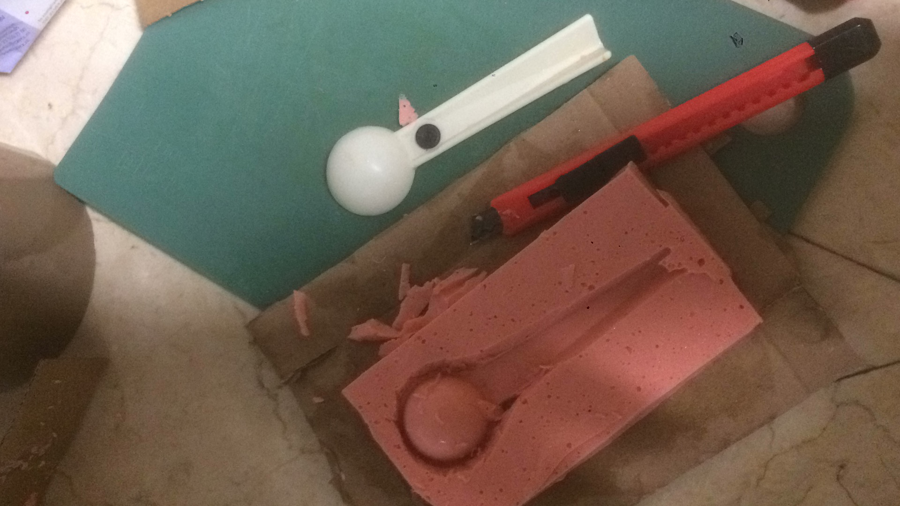

---
hide:
    - toc
---

# Emergent Technologies

## Remixing materials

During this seminar we have the opportunity to explore in a deeper way the material making through the de-contextualization of organic waste; it is an important exercise from any creative discipline to start exploring beyond the boundaries of our material diversity. From the product design perspective nowadays it is vital to explore new approaches to create materiality for solving presents needs, if we keep perpetuating the same approach in our practice, we as designers, never truly are going to make changes in the system.

As designer we are used to use to keep using the same commercial materials, perhaps for their abundance in the market and their cheapness, but hardly we realize that this market system is the same activity that are causing the current climate and social crisis.

If our intent is to design or to create a solution for these crisis through a product or an object, it has to be from an integral/holistic perspective, starting from identifying all the opportunities for a systemic approach in the life cycle of the product. As a result of these we can create meaningful relationships for enabling a circular economy between a diversity of stakeholders.

For my background I found interesting to explore the coffee “waste”, because I came from a small town in México, that its main activity is tourism, therefore there are a lot of cafeterias and restaurants, as well as in Barcelona. With this context I would like to explore the production of “tools” from the coffee waste, and so far I have been using the recipe with Pine resin and Carnauba.

3D model for a mold

Coffee waste, gathered from Elisava coffee shop (about 8kilos)

Samples

fail mold
