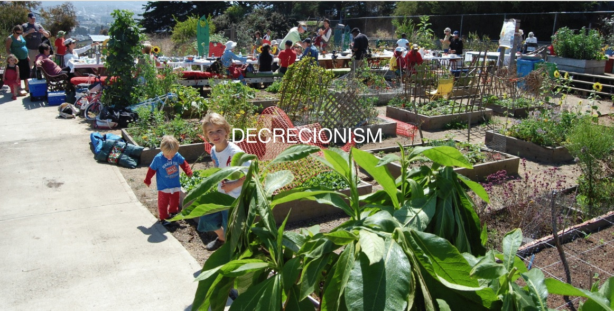

---
hide:
    - toc
---

# Atlas of Weak Signals 02

This seminar in particular was quite interesting and immersive in the many realities that often escapes the mass media or the general topics.
Through his presentations and images Jose Luis conduct us to a reality which often are unable to see, and to be sensitive to the progressive changes that have been occurring from many years, some of them in the last couple of years, others, from hundreds of years.

Is particularly interesting been able to understand that, until this day is common to hear from people the many environmental conscious activities that perform in daily basis, and each day more and more people are taking this matter in their hands, but apparently this is not enough.

Each of us as individuals are capable to have good practices in a social and environmental issues as well as many businesses and politicians, but apparently will be not enough and on time. We still have to overcome many invisible barriers from the demagogic leader, the economic system and we will have to give up our comfortable way of living.

We have to understand that we as individuals is not our fault but we are in a way accomplice of this system. As an example of that, our demand for globalized good leads to the different companies to seeks for the most rentable option in their cost, as an example of that it is the future commercial route for ships when the polar ice melts, without the ice, some routes could be more convenient for the ship commerce, if I remember correctly.

Examples like that are a reflection of how the current economic system has been prevailing from so many years. It always finds a way of colonize wills and appropriate almost any effort in order to have profits; from the jobs that we have, how the labor is used and resources are exploited; lying us, telling us that we need jobs to fulfill our needs. Other example of how anything could be exploited a used for profit is the surveillance capitalism feed it by ourselves and used for keep us inside a bubble.

From the Nation State could have a glimpse of how the economic politics work hand by hand, creating control system under the false pretext of the greater good, as a result we have borders, political imaginary boundaries that segregates one from the other with the solely purpose of protect the (economic) interest of a few. But at the same time the rising of decentralize models and technologies are putting in jeopardy the hegemonic power that this old structures have had.

It is clear that we have to identify to whom we are fighting as students of MDEF and to recognize the same practice in the different structures that we find every day; someday it’s going to take form of our partner, our teachers, or ourselves.

### The Invisible Hand
Is it impossible to think that our daily activities could lead to overthrown the current system? As a designer, are we enabling the same economic system when we create more sustainable products? Are we going to be able to live in other paradigm that the current?
The different topics covered in this seminar has to be present every day in our practices ass well in our daily life. They have to shape us and shape our interventions.
