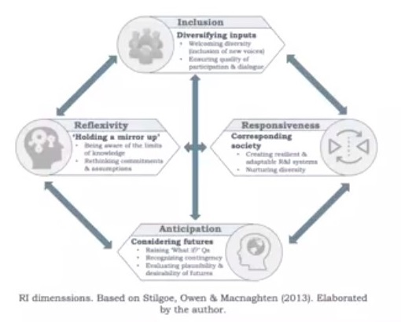
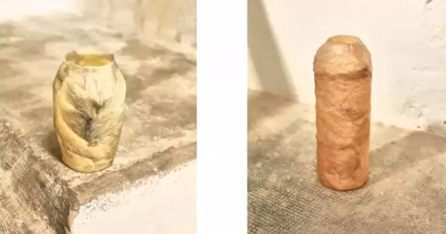

---
hide:
    - toc
---

# Future Talks

##Audrey Desjardines.
###First Person Perspective, Autoethnography

This lecture was from Audrey Desjardines.
She gave us a perspective from the design research process that she has been carry on.

It was a good opportunity to understand and to know different approaches for the design process.

She explains briefly the differences between First Person Perspective, Auto ethnography and that practices are more common in the social science; from the examples that Audrey use, for me was clearer the difference between this approaches and the research process in a linear process or conventional, like the one developed by IDEO.

This method for research present different challenges, from the documentations methods to the perspective or bias of the researcher, but at the same time is a good way to make a project richer. As a designer and researcher to maintain a broader approach in the process eventually is going to lead you to a variety of insights, questions, results and interpretations that hardly could have been obtained by other methods. It allows you to have discussions, and is a way to learn by doing in the process, to embodied the solution with the knowledge that you as a researcher are going to gain in that process.

Certainly is a different approach from a conventional design school of what I am used to, but whit out a doubt despite the barriers is an opportunity to let the solution emerge by itself without pushing it by a commercial agenda.     

## Sergio Urueña
### Responsive Innovation

- Be responsible and with a political notion and use it for framework the innovation within a design project.
- How can we shape better society with better technology, but by who and with whom?

With Sergio we review different examples of how science, technology and innovations have shaped our world and have change our social dynamics, but at the same time help us to shape the future in a way of how we imagine the science and technologies breakthrough mostly a technological determinism as a counter part of social constructivism; at the end we have to realize that in time the hybridize, shaping each other.

At the center of this materialism are as well designers, therefore we have to understand the responsibility in this process. In other hand is fundamental to understand the relationship between society, technology and innovation and how it interaction is framed also by institutions and governments in order to push an agenda.

The socio-technical approach allows us to understand the many relationships between the STI and the many layers in society. Accountability and access are a strong issue in STI because in many places are used or neglected by a dominant group, it is our duty to realize that our efforts have to dismantle this and work for a more accessible and horizontal dynamics in society.

Sergio as well present us a framework for RRI responsabilization, with 4 basic dimensions: Inclusions, Reflexivity, Responsiveness and Anticipation.

To recognize which system, actors, and futures are we empowering through our projects in a real context, where the final people can engage with it.

During the different terms, in the project, we have been detailing the people involve, and how we are going to present the information of the project, and eventually is shaping the design intervention, transforming and nourishing the ultimate design deliverable.
This design deliverable at the end will be shaped by the participation of the people that we worked through the different design interventions.

With our project of compost commune we noticed that the users could be very broad and diverse due to how well we can co-design a network between them. Another mindset that prevail during this process was the scalability of the network but thinking that can happen without our intervention, that in some point the people will engage in the practice of regeneration and will appropriate all the knowledge and making a strong community, having impact in different level of the socio political sphere.

## Laura Forlano
### Auto-ethnography

The talk from Laura Forlano, was an opportunity to have another perspective for the First Person Perspective due her research.

She spoke from the research approach in design, from the point of view of her as a subject, as a user that experiment certain condition and from that design the experience around it.

Her perspective was about experiment with emergent technologies and how they could be embodied from the first person perspective
Autoethnography and interaction with technology how it is part of her daily life, using of the system based in an algorithm that regulate the sugar in the blood, from that open the discussion about the relationships that the user has to create with the technology, how this could be hacked for be simpler or friendly to a particular lifestyle or condition.

The user is more about understanding the user experience in a post-humanism or transhumanism perspective, expanding this definition by our relationship inside a socio technical system.

From her research through the auto ethnography Laura remarks the importance of that acquired experience in order to have something that resonate in others; it is important to reflect from the own experience and share with other people and build networks and communities.

## Saúl Baeza
### Radical experimentation in design research

#### Visit Hospitalet creative district.

We can have a deep understanding of his practice and approach, and how he imprints a narrative that could transmit different reactions through common objects, reactions that are not commonly associated to them. It is important to remark how experimentation and practice is necessary in the exploration process.

This materiality approach could lead us as designer to speculate with our design interventions how people could behavior differently around an artifact, context or thecnology, and offer a radical interaction.

In the process of Saúl, we can appreciate the embodiment of the experimentation; how he is the first subject to be submerged in the concept and start the journey of living with it and learning  
Saul’s process is something similar to the process of Laura or Audrey, a different approach to First Person Perspective but framed for having a narrative in an object or a space. Eventually these iterations are used to learn as well but at the end only a few iterations are selected as representative artifacts of the concept.

In his process we can appreciate the value of reflecting in each step and try to have a deep understanding of the many relationships in an idea or concept, allowing to have a broader opportunity for the exploration.

Finally, we could appreciate how a studio focus in this process could work and what relationships have to be formed for function without compromising the creative process or the vision of the exploration.

