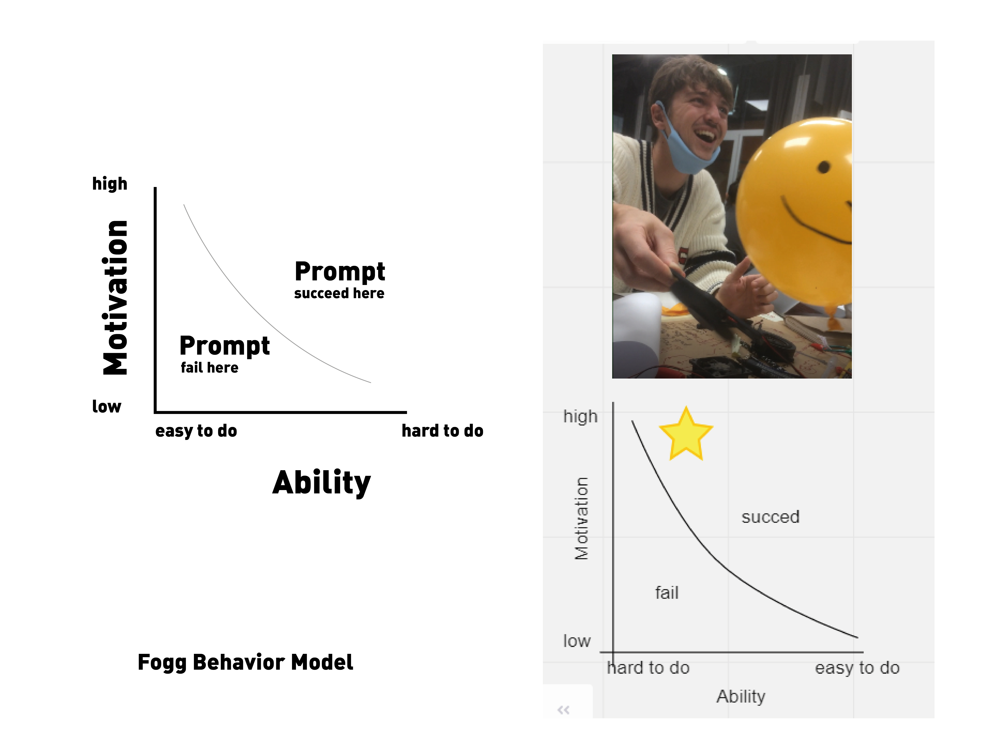
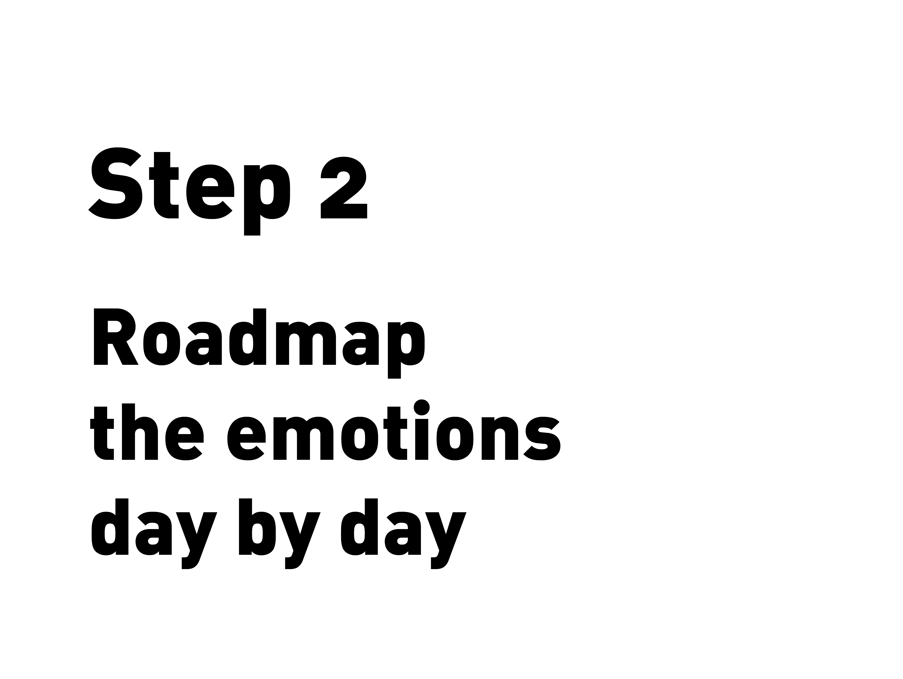
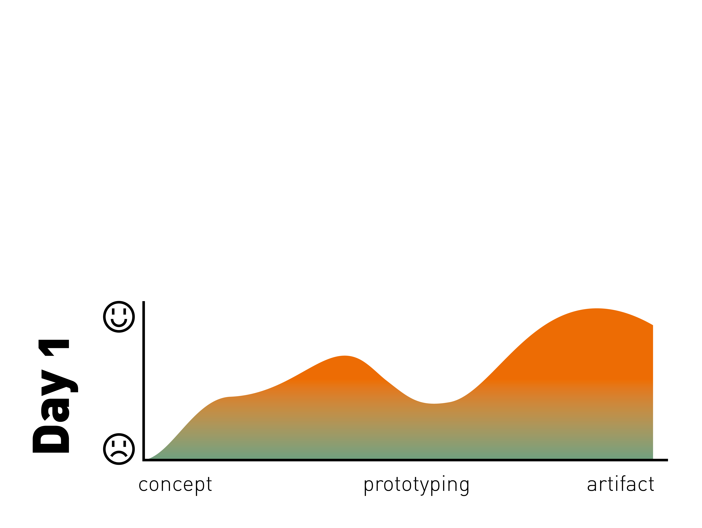
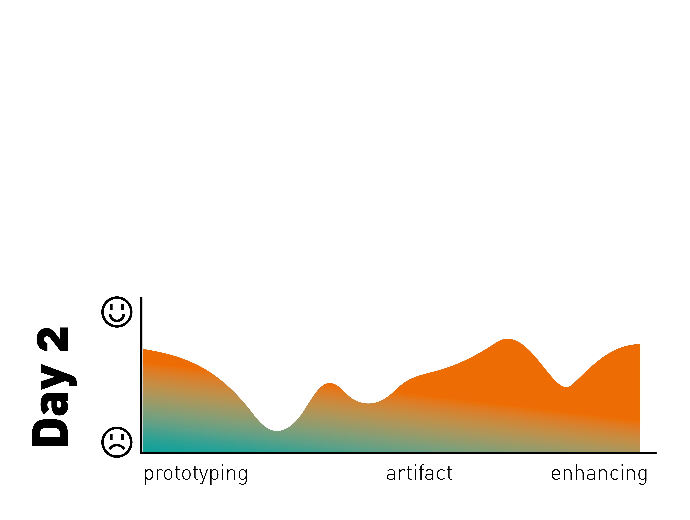
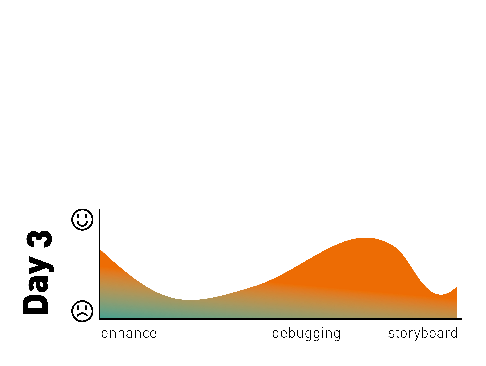
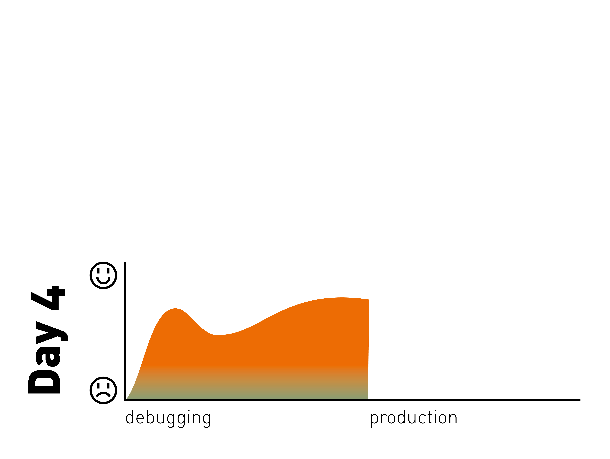

---
hide:
    - toc
---

# Documentation beyond presentation

##Refelction of my documentation process

At first, one thing that I have noticed is that I am not used to make a good documentation. Must of the time the previous documentation that I have made is for my personal process; in my work life a good documentation is not valuable as much as the final result. In my past experience, must clients doesn’t value it or it is perceived as an extra. For us it was important to show how we arrived to the final solution so, to that end, we used to make a basic slide show, with some pictures and results. Other thing that I know for fact, is that I lack of the general skills for a good documentation, I am not used to get track of the steps of a good documentation, furthermore I lack the skills for using tools for make visually appealing.

####Measuring the world.

For this activity we were supposed to use The Smart Citizen sensors to probe the first hypothesis. The hypothesis was to know if we are able to grown our own food.

Taking that as a starting point, we use the Smart Citizen for sensing and measure in different points around the block, in order to determine the environmental conditions.

The Smart Citizen sensors allowed us to measure: humidity, light, noise, CO2, we take that information to create average values for creating a chart. For making something useful with the information, we at first search a variety of edible plants such as spinach, lettuce, tomatoes.

As the second step, we search the basic environmental conditions needed for an efficient growth. After finding that parameters we made a chart to cross that values and compare them with the measures obtained from the Smart Citizen to obtain sweet spots for growing a determinate plant.

That information is always valuable to make design dentitions, but must of the time is difficult to have a logic approach in the methodology for obtaining them and process them to have some meaning for the means of design.

This activity represents a challenge at the moment of documentation because the main activity was conducted by the sensors. There were few human activities involved, such as placing the device, searching for the places and analyzing the data.

### Final reflection

In retrospective I would have planned beforehand the documentation in order to have a good understanding about the choices of the species of plants, and the chosen places. For this activity also could have been used some graphics for present the charts of the results.
Documentation is a complicated assignment but it is needed because the process is as important as the result (sometimes more important) and it is more easy to planned beforehand.

One skill that I intent to develop more is video editing and production in order to transmit better this kind of process and in a more appealing way and in some moment learn no to be bolder and more creative, that allows to connect the connect more in a more efficient way rather that a regular slideshow

## The Almost Useful Machines
###Documentation of the process

https://youtu.be/2ZdJCrXoViU

