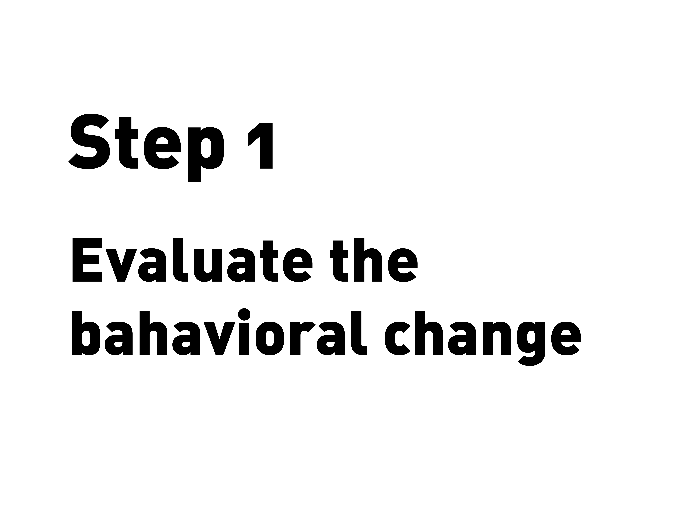

---
hide:
    - toc
---

# Documentation beyond presentation

##Refelction of my documentation process

Oh, my documentation process is bad, really really bad
Main points
-Not get used to it, in the work doensn apreciate
use to slideshow
-thinking to much in the Media
not handle well video tools, cameras or video editor , cero experience
In this escenario i tried to give a meaning the documentation and used as a mean to research a tpic of my iterest behavior, so in found the graphs and start mapind with the material i have
the assiagmen is difficult because you have to be in two places and be aware of both task
I was difficult because I wasnt know what to expect from the dynamic
knowing that now i could do thing different

## The Almost Useful Machines
###documentation

Video is comming

