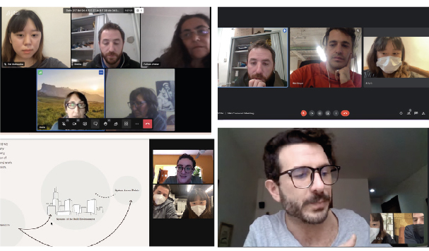

---
hide:
    - toc
---

# First intervention

For our first design intervention we decided to engage with people of different backgrounds to encouraged them for making his/her compost though a workshop, planned to communicate the process and develop the skills needed.

####COMPANION COMPOST BACKGROUND

Companions Compost is the result of our first design interventions framed in the first term. Working with compost is a path that I understand as an activity that could work at an individual, community, and city level.

This project starts with Rei Matsuoka's research about food waste; her research talks about how the food is managed inside a Combini store (food store in Japan). This is an example of how an unsustainable system works, in which it is not considered an alternative or the environmental or social impact of it. In that context, making
compost is an activity that could be a sustainable alternative for taking the food waste and transforming it into new food through a closed-loop system.

####CORE CONCEPT & DESIGN QUESTIONS
The constant change of society is a factor that directly affects the entire planet, therefore our present activities are shaping our future. From these many signals, it is possible to imagine scenarios in which it will be crucial for every person to have different skills and knowledge that are not developed nowadays, such as the
ability to grow our food from our organic waste.

We believe that compost will be an essential regenerative activity for any citizen of the future.

•How a bottom-up approach in the design intervention would engage in making compost individually?
•How people could be empowered by creating a universe of tools and repositories with accessible information?
• What is the behavior of people around the compost and how it could be designed?
•How a companion relationship could be born between persons and compost?
•How these companion species could encourage a connection with nature? (⁵)

####DESIGN INTERVENTION'S MAIN GOAL

As our first design intervention, we decide to try to engage with to make his / her own compost through a workshop, planned to communicate the process and develop the skills needed.

COMPANION COMPOST WORKSHOP
We search through a workshop to teach people how to make their compost among different groups of people, from children and IAAC students.

On one hand, the objective was to design the experience of compost-making to become a habit by making a companion species.
On the other hand, to have an opportunity for the personal organic waste, consumption habits, and eating habits, therefore leading to a questioning of the current system and what are going to be its repercussions in the future.

Through this workshop, we try to engage with people that could have some level of enthusiasm or interest in making compost, but they are lacking the technical information.

To make it so, from Rei’s research and experience it was designed a type of compost that could be easy to make, with small space, and fast to make.
Having both of these conditions as design requirements, we design the compost as a living being, a companion specie to create a meaningful bond between the user and the compost, creating the responsibility of taking care of it for mutual benefits.

To achieve that purpose first, we plan an initial activity in which the user, and the children could create their companion, by choosing a container and personalized it with drawings or props and naming it.
After the instructions on how to nourish it or feed it was given, an opportunity to reflect and question how the food is obtained and disposed of and to stop perceiving the food waste as “waste” and start perceiving it as a nutrient for another being, or metabolic system.

####COMPANION COMPOST WITH CLASSMATES

There are a lot of ways for making compost, This activity responds to the type of space available, resources, etc.
For this workshop, we tried to communicate a technique for making compost by using different types of organic waste for making it faster and more convenient for people that don’t have too much space.

We perform the workshop with the IAAC classmate that showed interest in making compost for a specific end, like growing food or having nutrients for their plants. With that in mind, we explain the process and the conditions need to make the compost and everyday easy activity.

After these workshops, we define some insights that help us to reframe our concept and have a broader understanding of the future that we wanted to design; after this, we formulate our Theory of Change for framed on a prompt question that would help us to shape our next design interventions.

