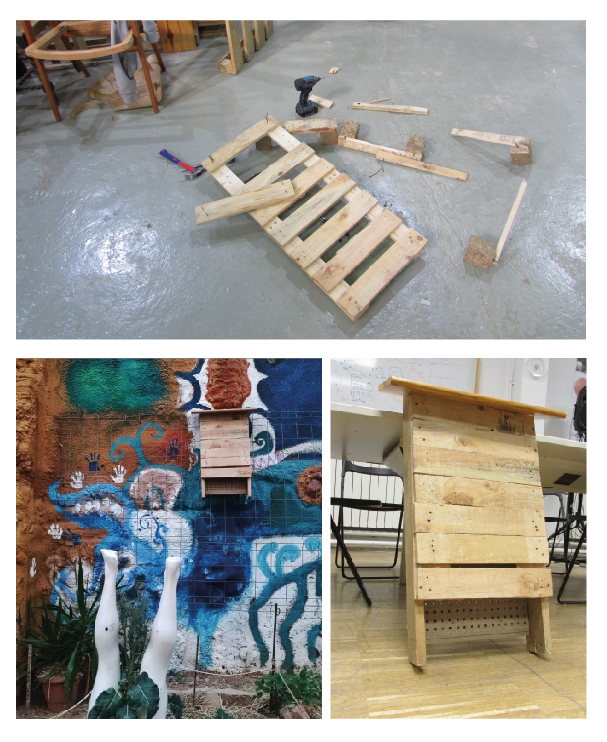

---
hide:
    - toc
---

# Second intervention 1

##FROM WASTE TO PRESERVE

As I started to collaborate on the compost of a community garden in Grácia, a necessity was born from increasing the presence of the biodiversity inside the garden as a statement of resistance and activism. It was an effort to give bio-relevance to a green space inside the urban neighborhood.

Their approach is the importance of a place like the garden in the conservation of biodiversity like the bats, which is an issue in Barcelona, and how it could be generated new relationships with the non-humans.

From my role as collaborator and designer, they propose the idea of making houses for bats with the specification of the Programa Seguiment Ratpenats a citizen initiative.

### THE WASTE COLLECTORS
From the initiative of some members of the MDEF classmates. With Didac Torrent, he organized “huntings” in Poblenou to search for "waste" that could be used, exploring the reuse and the upscaling of the material that can be found in the street.

From this exploration, I managed to gather some good material and use open-source information about building bat houses I was able to make a house for the bats, that now is part of the garden, waiting to be habited.

