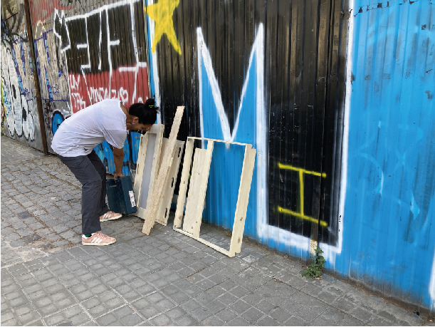
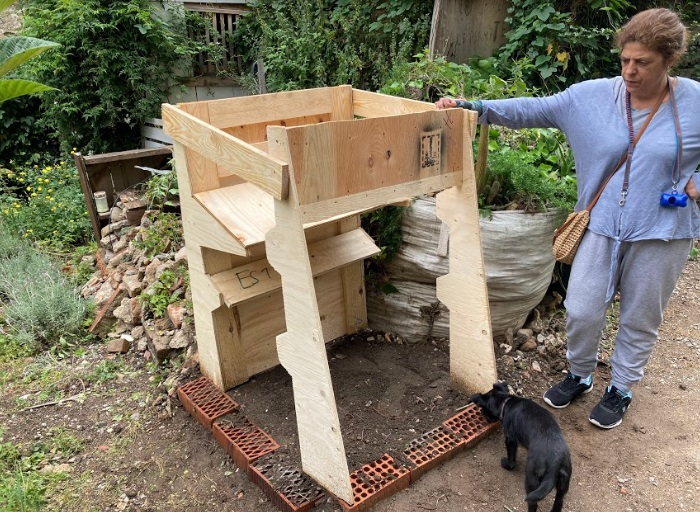

---
hide:
    - toc
---

# Third intervention

During the interventions of the second term, we conduct a variety of interviews, to understand and go deeper into the many approaches to compost making.

In those interviews, we detect a place in the same block as IAAC, called Hort06 Indignat. The concept that I am interested in search is how relationships could be encouraged by proximity and how the different roles of the members could be designed for empowered a productive block.

From this concept, we started going out to know better the neighborhood and asked the people nearby if they wanted to collaborate according to their possibilities.

From that direction, we find a community garden in the same block as IAAC. Hort6 is a community garden in an okupa space which is part of an initiative of the neighbors that sought a green space for social gathering but furthermore a space for being in contact with nature, growing food, and scape for their daily activities.

They function by assemblies and voting, and they don´t receive any collaboration from the Generalitat either they are searching for it and they manage their resources.

####POLITICAL PROCESS
We make a series of approaches to explain to them about the project and how we were planning to do it. The core concept was to design a compost processor around their needs and characteristics, produce it, use it in the plots and invite other members in the block to collaborate with their organic waste.

In the first meeting, we tackle issues about having a regenerative practice for a healthier land from their organic waste. We explain to them about the compost, the pros and cons of doing it and the context of the Masters, and how we wanted to build collaborative networks with other actors in the proximity.

Internally they manage their topics by voting so after the project was approved we have to define a physical place inside the garden, which was a complex issue, because, despite our explanation, the members still have misconceptions about the compost, like the smell, animals and past bad experiences. This process takes us almost 3 weeks and in the end, the final decision was taken by the most interested member of the community.

The final location of the compost was crucial for the production and for the prototype we wanted to test.
While the final location was defined, we made a participatory process to know more about the organization, the motivation of each member, and the time and resources that everyone can provide. We map the different barriers, and past experiences, what they expect from the compost, possible uses, and resources dedicated to the
garden.

After gathering all the data, we decided on the feature around the compost and eventually empowered them to be more confident to experiment and collaborate with other members of the block.

####FROM WASTE TO REGENERATE
In Barcelona, it is mandatory in any neighborhood to take the waste on a particular day for their recollection, in those days you can find it from furniture to pallets, objects, wood, etc. As part of the second intervention with other community gardens, building the chiropterans house, I used discarded pallets and materials found in the street for building the house using the material available. This waste management in the city represents an
opportunity for applying a circular economy strategy by reusing the discarded wood pallet for making almost anything.

From my last experience, I get the skills for hunting and working with whatever could be founded in the streets of Poblenou. For this intervention, conceptually didn´t make sense on any level to build it with new material or raw material; as part of the exploration of waste to nutrients, we make a collection of discarded pallets to have the material to build the compost bin.

####CONSTRUCTION
The process of building the compost was long because the decision on the final place was long, and we had to change spots inside the garden a couple of times because it was crucial to have a good and sunny place. During this time, we have the support of the most active members of the garden.

The fabrication of the compost was aided by the CNC machine in the FabLab. We used it for making some profile parts that allowed us to have a correct implementation of the design. After the compost bin was finished, we had
various meetings with the member to explain how to use it, and its features, and to establish the next interventions.

###ABOUT THE DESIGN OF THE COMPOST BIN.
After having our participatory process with the members of the garden to understand their barriers, pains, and resources around the compost, we had a review with Jonathan Minchin in which we decided the form and the process to be the more efficient for them.

