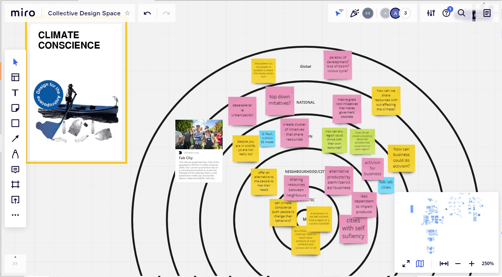
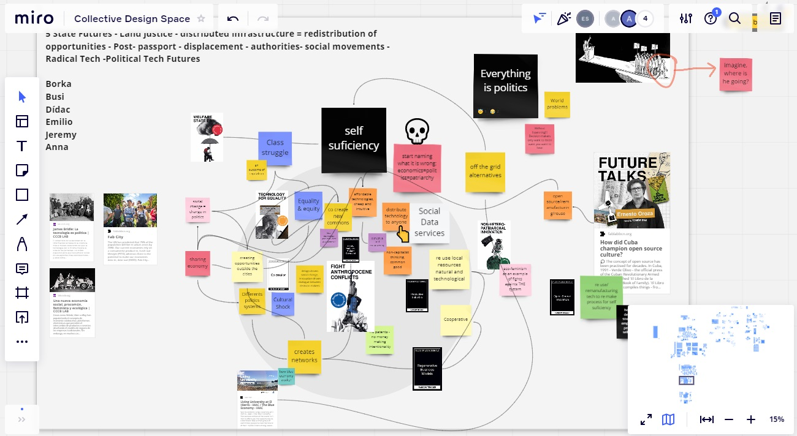

---
hide:
    - toc
---

# Atlas of Weak Signals

<h1>Choosing weak signals</h1>

*At first instance it was very difficult just to choose one, even two cards, because each card at some point represent a interesting topic full of possibilities. It is hard from an industrial designer point of view, not to be triggered by each card and to jump immediately to a design intervention.*

To many possibilities at the beginning just play with your head in a bad way, tearing your efforts in so many directions, and in a co-depending, apprehensive exercise, one starts to making a Frank-enstein of a design solution as an excuse to use at least 5 cards.
While we were hiking uphill, I was searching in my old bag of ideas for one that fits this Franken-stein solution but as we arrive at the top and we start to listen to Xavi, it hit me. I doesn’t matter if I have to use the card for one signal or another, because at the end I want my fight to address the environmental issue, it doesn’t matter at what level or from what perspective, it going to land there. 
At the top, the first task was achieved, I had selected Climate Conscience.

What I understand about the card is environmental issues as the Climate and its crisis, they are very broad and maybe technical in some points because it is transdisciplinary and interdisciplinary, if we keep the subject in a certain level of conciseness maybe we can be more effective, maybe we can design interventions like acupuncture just to work exactly at one point to unchain the reac-tion that we want.
The other agenda that I was thinking on, appear to me as Xavi was talking about the change in the use of the land in Vallés county, this agenda is the one that has to address to a shift in the eco-nomic system. In order to fight for climate, you have to pass through the economic system which is enable by the political power being their biggest threat, not just for environment, also for socie-ty.

So I asked myself: Wouldn´t be nice to design an alternative system that allows to the people to be self-sufficient, non-governmental dependent and that allows to thrive within the planetary boundaries?

<h1>Multiscalar diagram</h1>

Other trigger that I have in mind was the Circular Economy and Climate Justice.
At these moments I am thinking that there are many examples that address the climate crisis in a personal or domestic sphere, but what about in a corporate level or a SMEs level, with activities rather than residues separation or energy saving. If we are naming that economic system is the biggest threat to climate, so how can business could make a transition to a less harm or regenera-tive system.
At the moment I have many questions that are going in different directions.
Another question is how can we increase climate conscience to push people to a paradigm shift in their economic activities? Can climate conscience be the end? Or is a way to an end? If these is the case, what it would be de end?
Until today my biggest concern are the resources management or self-sufficiency and the econom-ic system.
I’m still working in this scales

<h1>Collaborative design space</h1>

Finding resonance

At these point with my peers at the panel 5 State Futures - Land justice - distributed infrastructure = redistribution of opportunities - Post- passport - displacement - authorities- social movements - Radical Tech -Political Tech Futures, I feel that I was pushing the agenda for self-sufficiency re-gions or maybe in domestic.
I tried to make the connections between some triggers like the reuse of tech like a strategy for self-sufficiency and also how it could lead to a change in the economic system

<h1>Next steps</h1>
--Someone you would like to contact
Fab cities
El Hierro, Blue Economy example,
Mónica Navarro, CEO y Co-Fundadora de Delicious & Sons, type B business example.
La casa de Carlota, is a design studio that I have found as an example of business inside the crea-tives industries which operates as B Type Company and offering social impact strategies for their shareholders.
Alba Obiols, Responsable Diseño Circular en Barcelona centre de Disseny
Anna’s father

--An experiment you’d like to make
Ask people some questions such as:  If they know that at some point some of their activities causes harm in the environment and what would it take to people to shift to another economic par-adigm.
Another experiment I would like to do Is to measure the impact on people of the data visualization, what I mean is that there is a lot of examples, exhibitions, data representation, art works, activism and so on, about the environmental crisis caused by human activities, I would like to know Is how much or how little a person changes their behavior after be exposed to an information of these kind.
Because I would like to understand why is taking us so long for making changes in the way that we are living.

--A new skill you’d like to add to your personal development plan
to Use the magic wand to appear solutions out of nowhere to climate crisis.
An skill that I want to add is to fix something broke, like a computer,a printer or a car engine just following a simple manual, like the “El libro de la familia” just to understand how easy or had could be reuse, remanufacture or repair all the resources around us.
