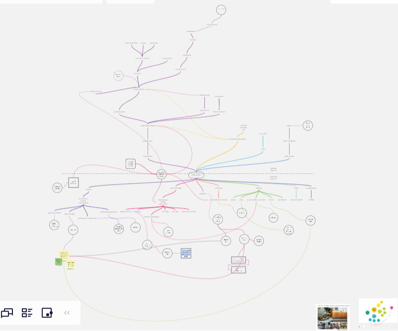
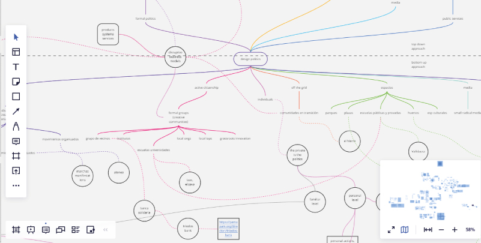
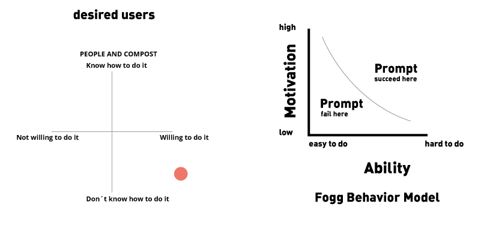
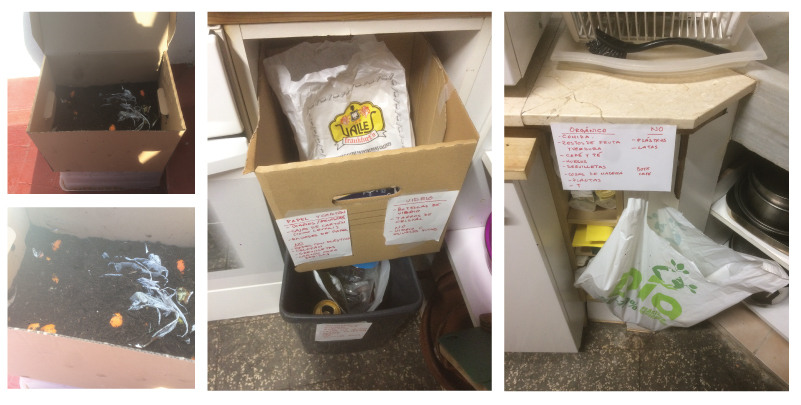
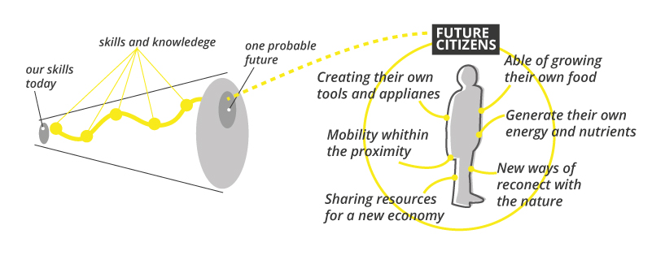
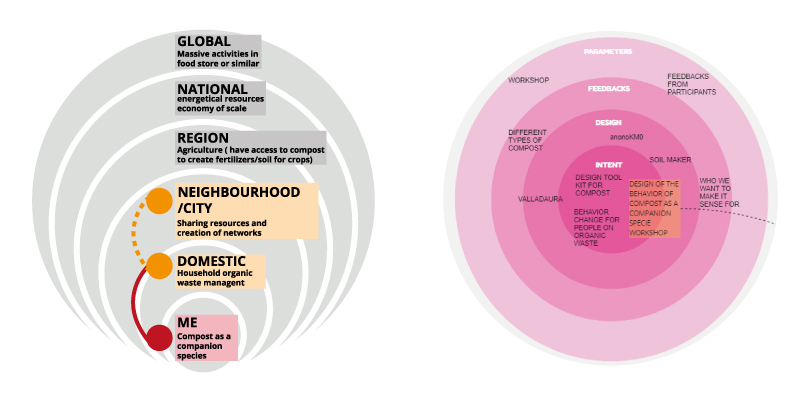

---
hide:
    - toc
---

# Community Engagement

## Design politics
At the beginning of this seminar it seemed to me that I had everything planned and figured it out, but as the days progressed I discovered things that at some point I had left aside.
For me, this seminar is the central part of the design studio and it helped me a lot to reformulate several times the approach of the project, which is in a constant evolution.

At first, my objective was to work on design politics, since I consider it a powerful practice to shape our future from another perspective and it is often neglected in design or seen as a taboo; what I was leaving aside is the lack of structure to frame this practice in a transformative collective activity, as I was planning the intervention of the design from my ego and not from the echo, the design works with the others.
So far I have been mapping the possible design interventions by mapping certain actors in the system.

## Companion compost

After this reflection during the seminar Rei and I, decided to work together in a collective intervention with the compost for many reasons; It is a subject in which Rei has a previous research experience from her Bachelor's and we recognized that we can work with it from different design postures as well to seek a behavioral change and opening the discussion to identify more complex topics and systems.

For framing a  behavioral design intervention, we are looking for important resources, so far we have explored the work of Susan Michie and BJ Fogg, which from we used his diagram to plan our design intervention; Lately, Otto Scharmer's Theory U seems like a good framework for the compost making activity, since it is a physical activity that make people get in contact with and reflect on their organic waste, about their way of consume and shift the perception from  waste to organic inputs or nutrients for the compost (which later we call the compost a companion specie), we try to design from the individual to the collective, so the next design interventions we think that should be oriented to co create a network or community through empowering each person to make their own compost as part .

As first step for making the compost, was to internalize the general waste management from a personal perceptive, first of all I spoke with my roommates about the types of waste and we organized our waste in containers according to what was requested by the Generalitat and by On the other hand, I started to collaborate with the compost of a community garden (Cal A Trava).

During the seminar we talked about our agency as designers and how we seek to positively affect the different systems. As a collective intervention, we want that the compost to be a regenerative activity that allows people to be in contact with the body and the land.
From this, we established a theory of change where through certain questions we will seek to define some skills and knowledge that would be necessary for the future citizen; It is within this context of a desirable future that we place the activity of making compost as an activity that allowed the people of the future to be in contact with the earth, with their own waste and generate their own food, energy and regenerate the soil.

This approach, allow us to situate the design interventions with the compost within a system, since we perceive compost making as an activity with great potential for personal and collective change.

