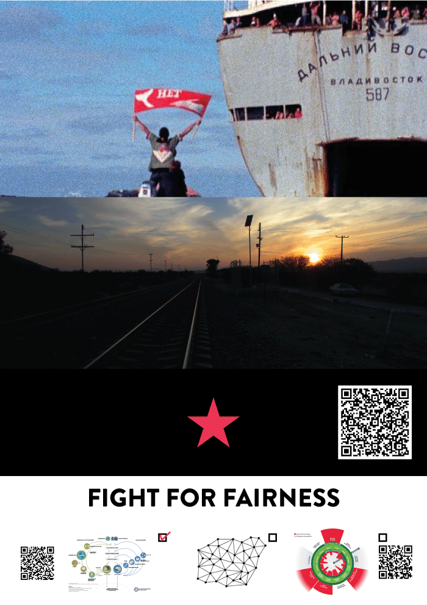
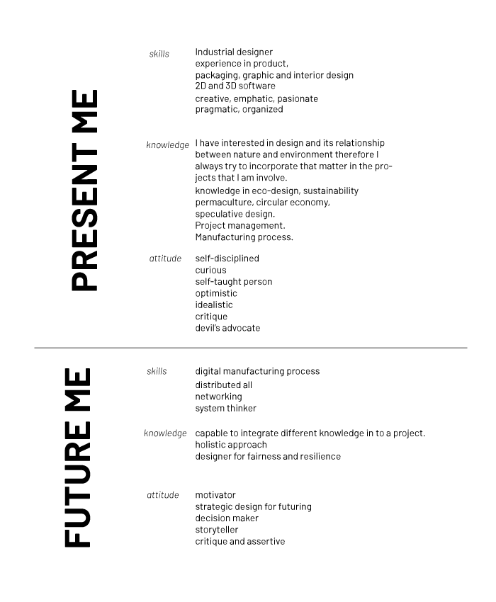
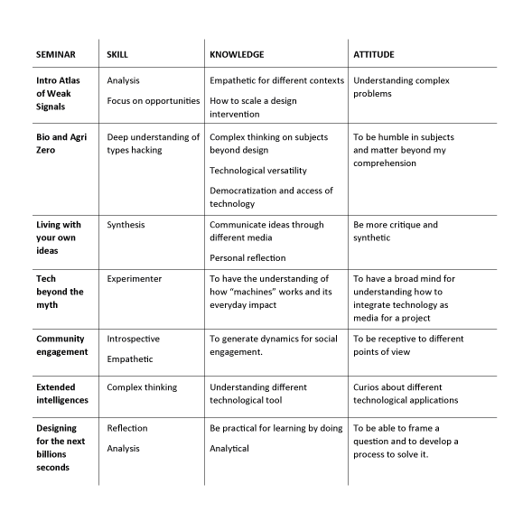

---
hide:
    - toc
---

# Bootcamp

<h1>Design for fairness</h1>
My poster was a pretext for put together some causes that motivate me to work for a fairer world. 
It is unfair that environmental activist has to put their own live at risk for protect any kind of species or just their territory, like Berta Caceres an environmental activist that was murderer in her house 
There are some many examples of communities that lives almost free of needs of capitalism, like the Zapatistas. They have been told to people many times that we have to fight in our own territories with our own tools, so that´s why my fight starts with design. My fight as a designer is to improve the design solutions with new knowledge, working with people and be responsible and proactive about the social and environmental impact. 

<h1> My proffesional identity</h1>

<h1> From the meetings</h1>  
Be more structured in order to communicate and organize better the information or the goals of a project or intervention, for some people it is better to understand a chart or an infographic rather than a bullet presentation
Be more enthusiastic, first impression never forgets, with that in mind in order to work with groups of people, it will be important to engage with them since the beginning.
Colorful, not everything is white and black , and broad or holistic, not everything it can be done from the design point of view, in some occasions a designer has to take a step back mostly in cooperative project.  

<h1> Personal development</h1>
I have worked in the past year as a designer responsible of develop may kind of projects, but hardly those projects leave space to experiment or try another knowledge or discipline, for me is important at first instance to communicate an idea effectively and to engage passionately and effective to a group of people or community because always a design solution has to be involve in a network.
For me it is important to have a broad understanding of all new knowledge and or technologies in order to push the envelope and go forward in the design process, because that knowledge is a medium to potentiate the design solution.
Furthermore, I will search to engage with several disciplines in order to have a vast point of views, always having in mind that the people that have the problem is always the ones that can have the solution.  

