---
hide:
    - toc
---

# Bio and Agri Zero

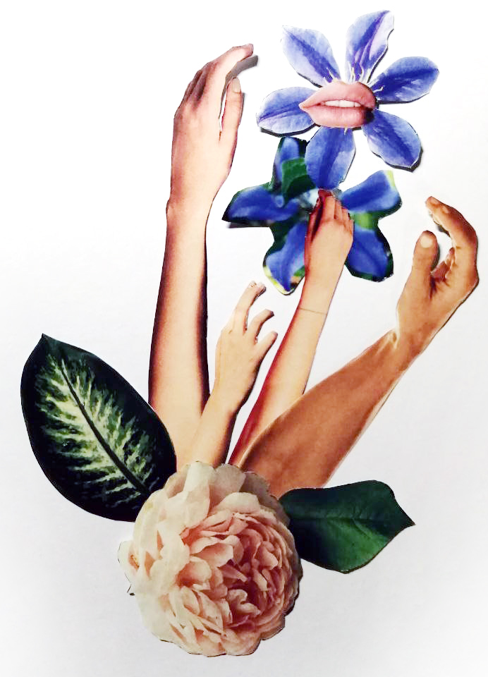

##The observation in microscope
The samples taken for the medium of yeast DIY , were taken from the from the trash bin or containers, each container have to ways of open.
1.	From a lever that could be operate also with the foot
2.	A handle placed directly in the main lid  
foto
*Hypothesis*
Both samples will be the same or similar
foto
Result
The separate handle is the worst.
foto

##Soil Samples

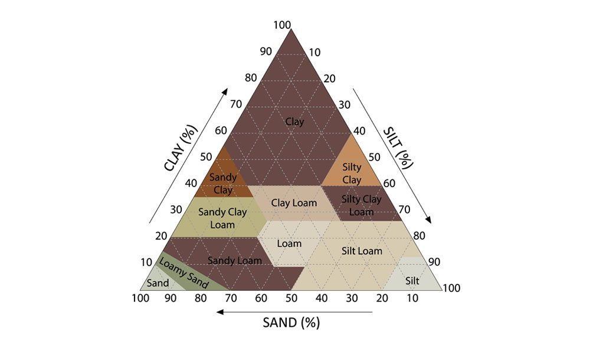
After the samples of the soil taken from the trip to Collserola Natural Park we, try to identify the composition of the samples from different types of tests and observation.

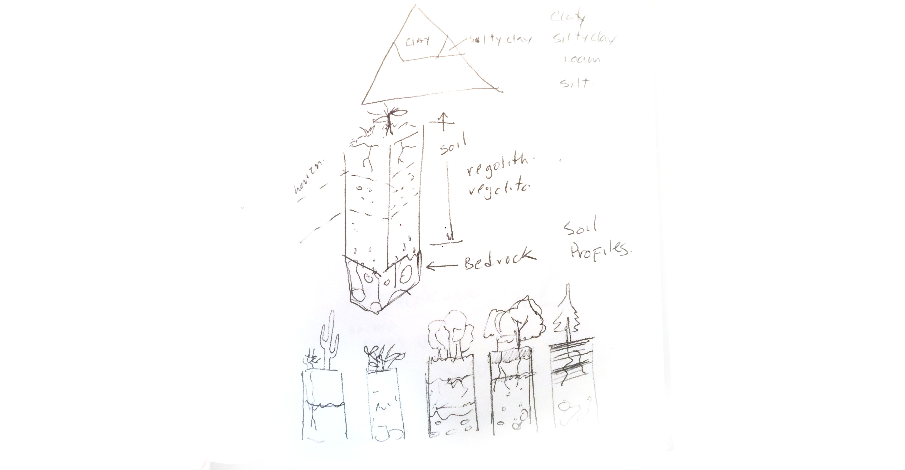

In particular, my sample didn’t work well a sample because was the top soil, mainly composed from leafs and small branches.
We didn´t performed the text well

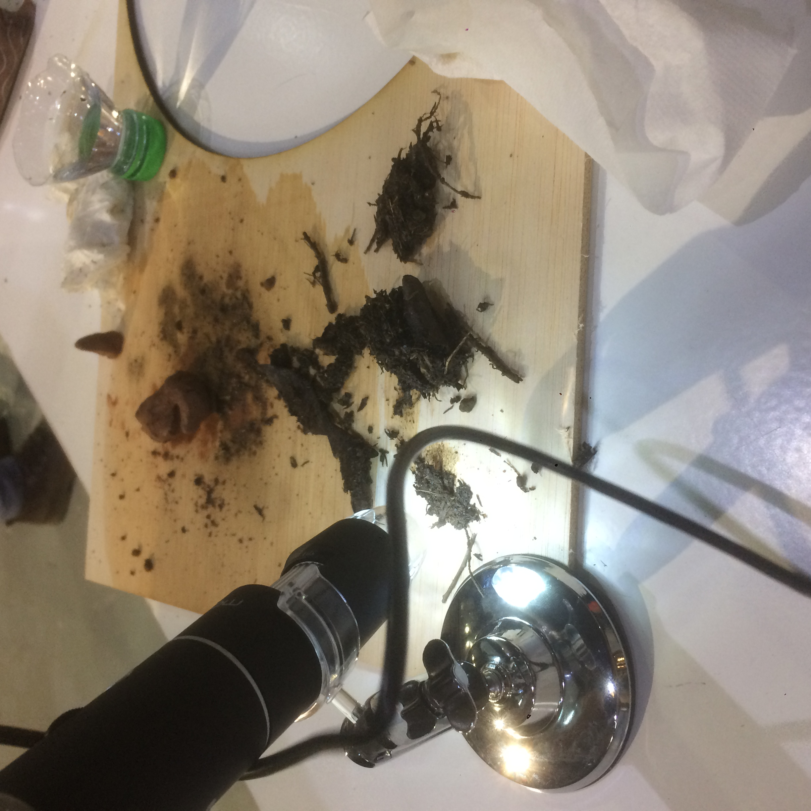
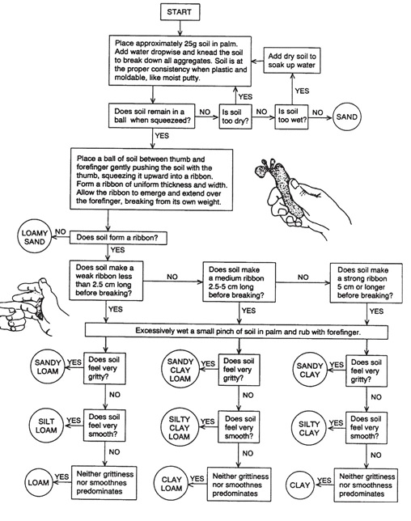

##The adopted
From the samples collected of one of my partners, we found a small leggy plant growing inside the bottle, so I adopted it.

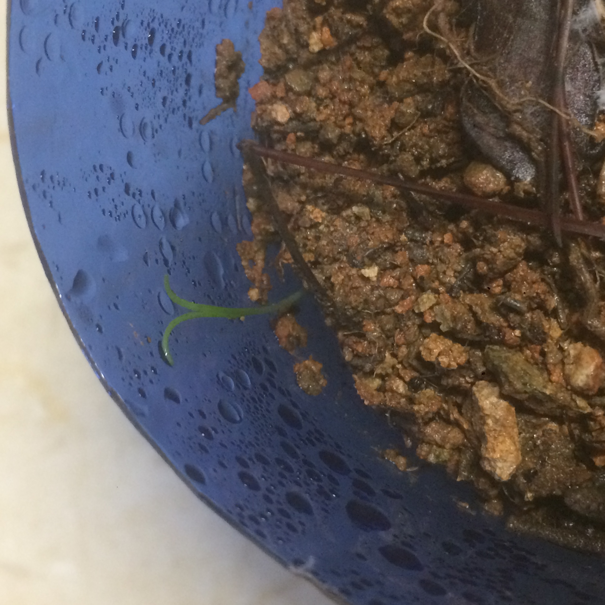

But sadly I think that I over watered it and perhaps kill it. That is a shame because I tried to do everything that one is supposed to do to keep plants alive but doesn’t work.

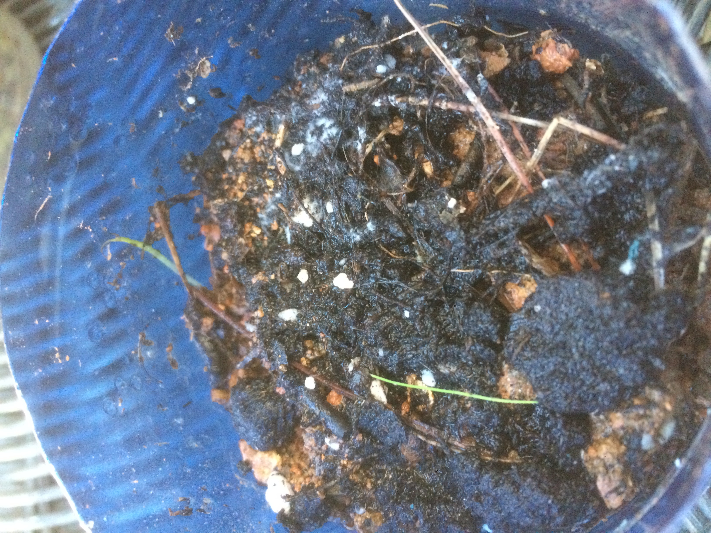

> ###Insight
>It is worrying that I can be able to keep a plant alive, in fact the plant was doing ok growing inside the bottle for almost a week and when I decided to adopted it died, so what would happen if I decided to grown my own food?

##Essential oils
In this part of the seminar we were shown how no make essential oil from a distillation equipment. Basically the equipment allows us to distill any substance present in the plants. The amazing part is that it took a lot of Laurel’s leave just to make a small production of essential oil. It is considerable the amount of resources needed to that kind of production.

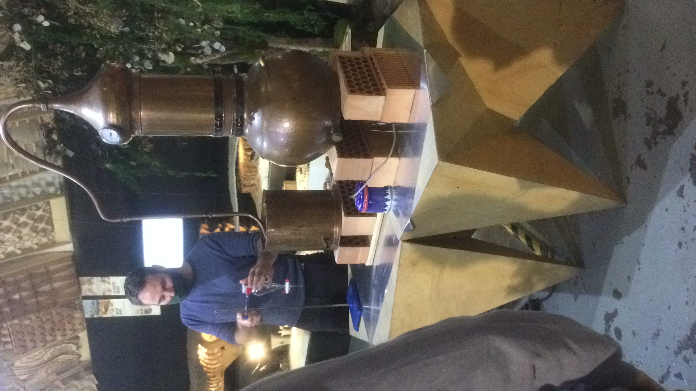

##Design a mutant
###PET-eater Mycelium

> *References

><https://2019.igem.org/Team:Humboldt_Berlin/Description>
<http://2016.igem.org/Team:Tianjin/Description>

The example from inspiration talks about an algae Chlamydomonas reinhardtii used as a chassis for having an enzyme that can break the polymers chains into monomers by degrading it basically with two kinds of enzymes, PETase and MHETase. The PETase degrades PET into MHET (mono(2-hydroxyethyl) terephthalic acid) and MHETase degrades MHET into TPA (terephthalic acid) and EG (ethylene glycol).

So my mutant is to take a Mycelium as a chassis with this types of enzymes and spread it in landfills in which there are the most amount of the PET unused, mixed therefore un-recycled.

The objective is degrading the most amount of PET available in a Landfill and reduce the volume of it, allowing other process for handle the mixed waste more efficiently.

##Scientific paper review
###Mycelium as a biological network (an example of biomimicry).

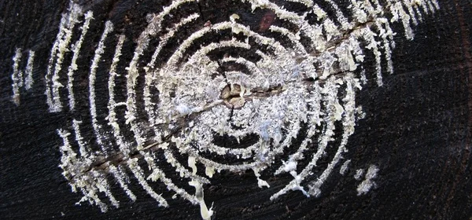

From the example shared in the seminar about the networks created from mycelium, I start reading and searching more about this.

If we can talk about the flow of nutrients in the mycelium network could be used as a biomimicry concept extrapolated to different kinds of networks; as an example if we talk about decentralized manufacturing, we can design routes for or networks of local manufacturers, craftsman or workshops as input of flow or as a node then we can distribute the “nutrient” created by them in the network.
Each node or manufacture will metabolize a good that could be flow as a nutrient in the must optimal path within the network.

Could it be the same as the Graph Theory and find the optimal way to transfer atoms, instead of having big manufactures, we can have smaller ones with less consumption of resources, less environmental impact, more cooperation and wealth distribution.

Create networks for distribute atoms.
So far the lectures about that are the next:

><https://link.springer.com/chapter/10.1007/978-3-642-01284-6_4>
<https://royalsocietypublishing.org/doi/abs/10.1098/rspb.2007.0459>
<https://www.ncbi.nlm.nih.gov/pmc/articles/PMC2288531/>
<https://royalsocietypublishing.org/doi/abs/10.1098/rspb.2007.0459>

##Biomaterials

From the webpage Materiom, I found a recipe for a bio-material based on coffee composite. Since I prepare my coffee at home and I drink a lot, in the next weeks I will have enough coffee waste for starting with the prototypes.

><https://materiom.org/search>
<https://materiom.org/recipe/171>

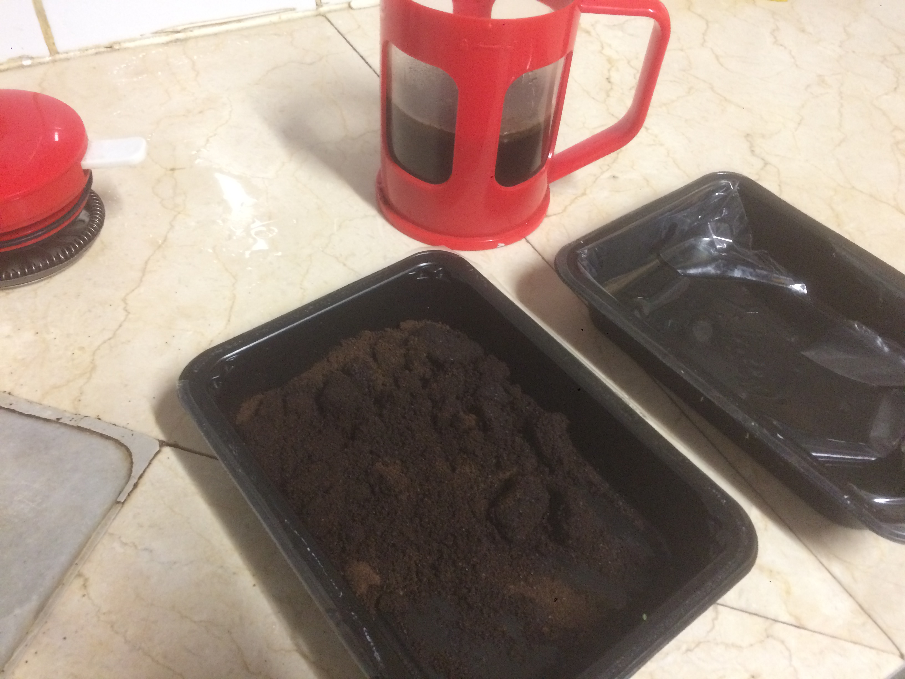

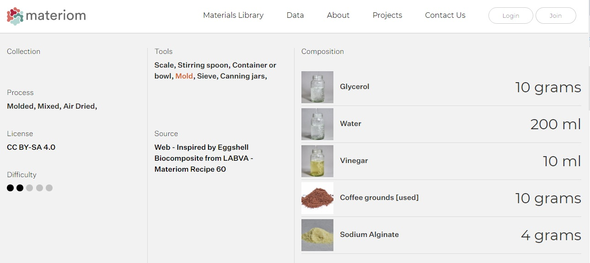

> ###Insight Agro Zero

>Insight

>From the concept of Timothy Morton of dark ecology, in a moment when there is no more space for growing food or there are no people willing to work as a farmer, could the build environment be used for producing our own food? Could we hack our buildings or our homes to have enough space to grown our own food? How can we reproduce the environmental services lost from the nature?

>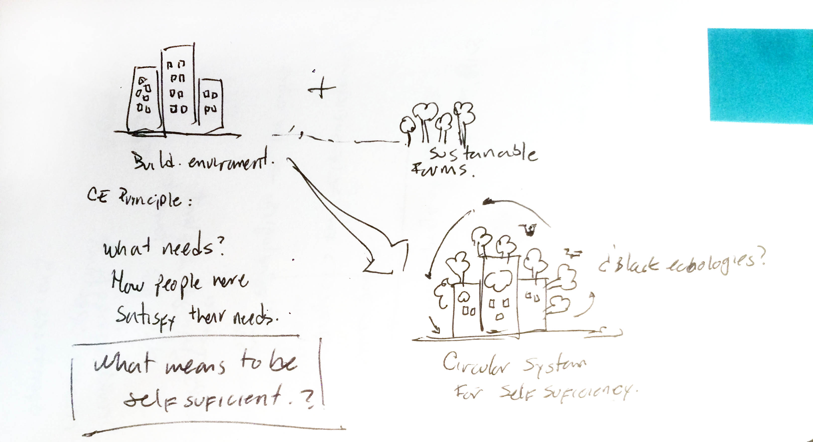

>Are we going to live like in the future such as the one proposed by Superflux in their installation “mitigation of Shock”?

>Let’s see the outcomes of seminar such as “Responsive cities” I will follow that closely.

><https://superflux.in/index.php/work/mitigation-of-shock/#>
