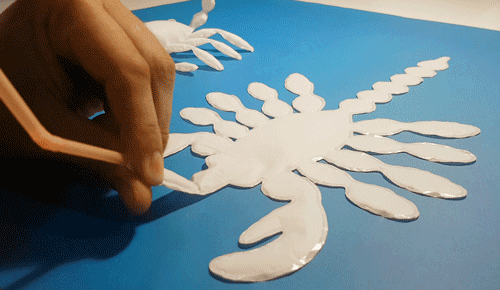

---
hide:
    - toc
---

# Living with your own ideas

## The empathy machine

At first it is baffling to try to understand the velocity of the seminars but I understand the valuable of building knowledge through the making of prototypes.

For this assignment of having one self as a mirror for design for other (1pp), the question: “what magic machine could help me in my life?” was without doubt a machine that could tell me what the other people is felling, and not only to know the felling but to feel what they feel, to feel it in my own body.

So basically my magic machine it’s a device connected to the head of the subject and then a cord connects the head device to an interface for my hand from I get to feel trough touching with a special glove

And give it a second though with the comments of Oscar and Kristina I put a lot of filter for just understand to other people.

###Insight

One thing that I can catch from the dynamic is that when you put yourself in the 1pp perspective you can use your own self context and body in order to reflect in the other anything.  In that action you can see yourself reflected at the same time, therefore you recognize something about yourself in the other and the similarities start to appearing, having at some point some level of empathy.

That maybe can be obvious in some point but it is clear for me and I hope that is the same with others, that one design for the other, the interaction between people or designing for people and whit people shape us. We have to design having in mind the other person, we could design for connection, meaningful interaction or whatever; but the main thing that shape our design is designing for the other, it shapes us, shape our practice and shape the characteristics of the interventions.

Design for the other make us empathetic and humble, realizing that, no matter what, always has to be another self, another entity that at the end has to thrive trough the design intervention.

With that in mind the design activity makes us humbles, emphatics and vulnerable, and make sense with the words from Ron Wakkary to Arturo Escobar, etc.

Not many people are willing to be vulnerable or empathic (for their own reasons), and the question that lies here is, can we teach to the non-designer how to design for the other in order to transform them into a more emphatic been? Can a non-designer design for another entity such as the environment? Therefore, having a meaningful rapport.
Can the non-designer could be more emphatic with the environment or immigrants, when he, she or they are designing with them and for them?

The point is understanding why if must of the people is aware of the environmental and social crisis caused by capitalism, no one is willing to make a radical change or systemic change.

# 1PP EXPLORATION
##Searching for meaningful interactions
### Guided reflection.

Briefly:

*• What did you make? And why did it matter?*

I tried to have interactions with people in the street, as first attempt because I found important to be relatable with people I is an effort to understand how to connect with people in different ways or levels. For me is more to develop a skill because at one point we have design with other and for others, and in order to do that, we as designers need to understand how to engage properly with people or communities in a horizontal and participatory level for having meaningful design outcomes

*• What happens when you involve yourself?*

For me 1pp I tried to understand it as an exercise for exploration of an idea, but in some point, because of the nature of my exploration, it became blurry at first the line between an exploration and an ethnography.

*• What happens when you use yourself as an instrument?*

Many things happen during the exercise, I tried to adapt myself and to have creative responses, but at the end everything flows perfectly when the interaction starts spontaneously.

Another thing is that in some point of the interaction I became aware that I was in a roll of designer making an investigation of the subjects so I try to just relax and be a subject of experiences that was a meaningful interaction. In that point I stop to worried about the information or how I was going to present the exploration. At the end I accomplish the goal of my exploration which was to have a meaningful interaction.

*• Did anything change about your way of working?*

It changed a lot that day, in first place because at first I made an attempt to approach people but I think it was in some way disruptive and not pleasant for them to interrupt them, it doesn’t matter if they were not doing anything and form it was not spontaneous from my side, I choose who to approach and how to start the conversation and also I was feeling insecure because I was having a little bit of a cold in those days.

The second attempt was more easy because I identify a group of people which I know we have common interest or at least something in common. As a result, I got a meaningful interaction and the only thing that I had to do was to go there with them, spontaneously.

*• What does it mean for your future work?*

That if we try to design the social interaction most of the time we are going to have random outcomes, so in a way a design for social intervention could be designed for or with some degree of randomness and spontaneity.

*• After seeing the videos of your collective, how does it change your understanding of it, present new opportunities or inspire new possibilities for collaboration?*

I found amazing work of the collective, with a topic that could be explored in deeper or critical way such as the contextualization/decontextualization of the objects performed by Andrea, that approach could be used as tool for criticism, also the context/empathy exercise from Busy and Angel offers a good perspective of understanding the world could function if we are not the same person with the same qualities as we are now.

Also I found very interesting the approaches of comparing or analyzing the products we use or how we as consumers waste. Everyone has a unique approach and, so far, I think they are interested in a grater good.

<figure class="video_container">
  <iframe src="https://youtu.be/FwcUjw-nsCc" frameborder="0" allowfullscreen="true"> </iframe>
</figure>
