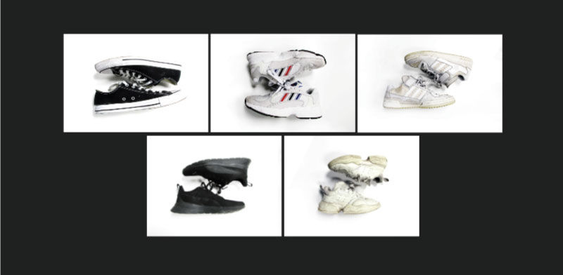
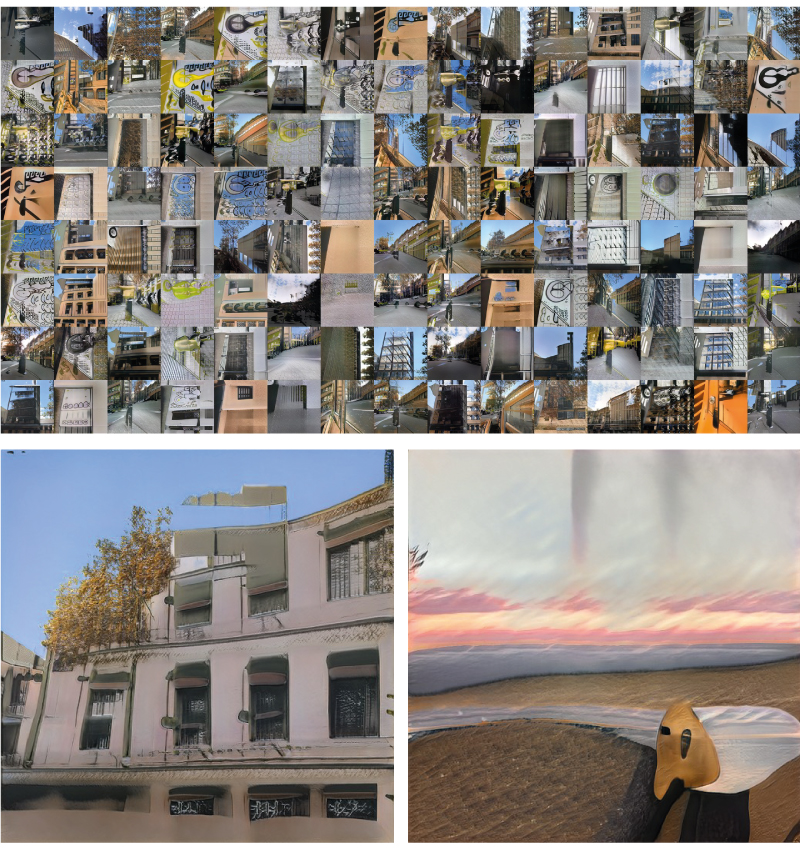
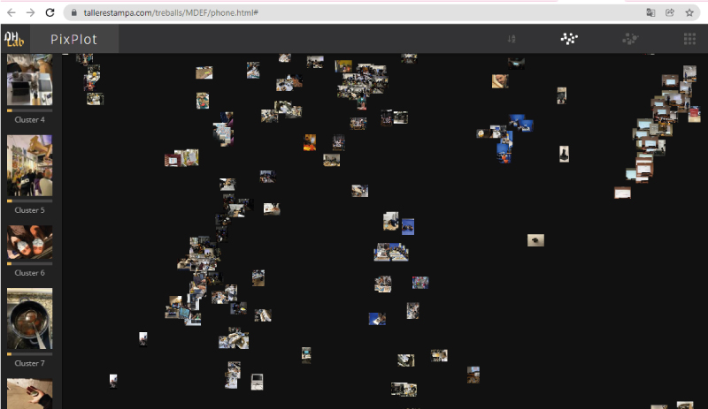
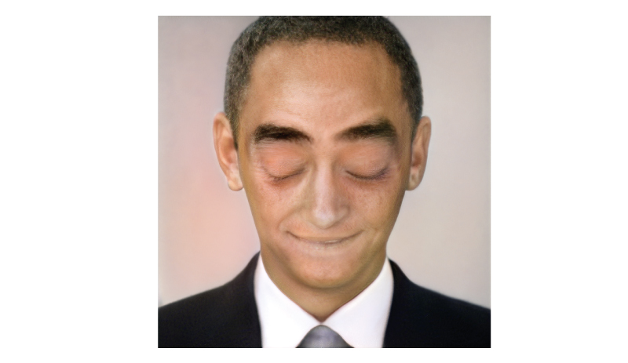

---
hide:
    - toc
---

# Extended Intelligence

### Machine learning

This past seminar was a challenge to my understanding, but at the same time it was a huge opportunity to learn a new tool and be able to understand a little about Artificial Intelligence, Machine Learning and Deep learning. Topics that are totally outside my field of expertise, but it is interesting to understand all the technological tools that are available to be able to have a more nurturing and responsive design practice to current times, allowing us to have design responses that we had never imagined.

The first week we focused on Machine Learning through datasets and training. On a personal level I lack a lot of vocabulary and understanding about coding and programming, but the point of the master is to understand and use as much as possible.

At this seminar we did different activities based on the image datasets. In this particular example we start from datasets that are formed from images of portraits which, when mixed, generate a realistic portrait of a person that does not exist.

Through intelligence training, infinite results can be generated by mixing the different information available in each dataset to create images that are realistic but beyond the normal imagination. In the case of portraits, it is difficult to identify the creations of intelligence to the real ones.

From this process we carry out two different exercises. The first was to create a dataset from the images obtained from our cell phones around Poblenou to observe the process carried out by the training, in this case we saw how this training classified the images and surprising images were generated from this dataset.

EmiliObama

The second exercise was in teams in which we used different trainings available on the network to create merged images.
We sought in this exercise to create a dataset of our personal objects, which were a reflection of our personality and from this, create new objects from this data set.

We seek to create a card game which would be the recipient of this identity creation, taking as an example reference such as the Buzzfeed personality quizzes which tells you what kind of pizza you are, or what Disney princess you are.
From this exercise, I was able to observe the infinite capacity for creation that an intelligence with sufficient training and sufficient databases can have.
Presentation link
Derived from this activity we find different examples such as Philipp Schmitt, who through training and certain input the computer can design and create an object in this case it is a chair, the result is an image of a non-existent product but that being interpreted by a designer you arrive at a finished product, but in certain examples not so functional.
https://nips2018creativity.github.io/doc/the_chair_project.pdf
Which raises a question, if it is possible that the intelligences with enough dataset can design with the minimum of information.
Currently, consumer products manufacturing and sales are dictated by the market rules and its imposed trends in fashion and aesthetics, therefore, this product are subject to a temporality shorter than its useful life, this business model has a result in an overexploitation of the natural resources and in the same time creates a difference between social classes from the creation of luxury products, giving an undeserved power to designers.
It could be that, through a trained intelligence, the access to any product could be democratized, giving the power of the designer to a person with no level of training, removing designers, brand companies based on marketing from the business model.
Rethinking their own needs without a market bias, users can express their needs in an understandable medium by intelligence and from this input and with the dataset and the necessary training, products could be designed and manufactured as the users demands and not to the demand of a business model. Probably there is enough products created in the world for creating an almost infinite database for not to design any product again.

### Extended intelligence

In the second week we deepened in the understanding about what intelligence was and how it was perceived and created, which generated a series of questions.
During this week we work on the speculative case of how to create intelligence in an object, based on this questioning we select a study table or class room table, within an ordinary classroom; the function of the table is to generate stimuli that allow students to maintain continuous attention to classes.
The table obtains the necessary information through different sensors inside it, which allow it to detect when the student begins to be distracted, these stimuli are the blinking speed, the frequency of body movements and brainwaves.

At the moment in which certain values of each measurement are reached, the table unleashes a stimulus on the student in the form of an electroshocks in the elbows, which allows the student to return to a state of mindfulness.

Interesting discussions were triggered towards the ethics of using certain measurements that could be invasive in people and, on the other hand, the difference in using positive or negative reinforcements and which could be the benefits and contradictions
Presentation link

Deepfake for XR change
On a personal level, I would like to explore the Deepfake technique for activism, I am currently a volunteer in an organization of environmental activists. As a disruptive activity, a Deepfake of world leaders could be used to announce good news of a promising future, making this a public event, allowing a questioning between the viewers of what it would take for that change to really happen; the goal is generating fictitious good news to have a questioning of our reality.
As an example we have Yes Men and his fake releases.
https://theyesmen.org/hijinks-all?view=fake_press_embed_block
